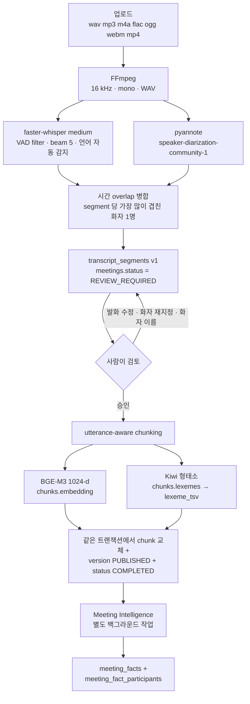
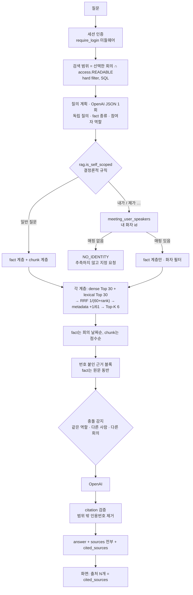

# Minutes

**회의 음성을 검색 가능한 지식과 관계형 회의 정보로 바꾸고, 사용자 소유권 범위 안에서
대화형 질의를 제공하는 Meeting Intelligence / RAG 시스템.**

```
Audio
  → Transcript                     faster-whisper STT
  → Speaker-separated Transcript   pyannote diarization × 시간 overlap 병합
  → Human-reviewed Approved Minutes  사람이 고치고 승인한 뒤에만 지식이 된다
  → Searchable Knowledge           utterance chunk + BGE-M3 vector + Kiwi lexeme
  → Structured Meeting Facts       요청 · 결정 · Action Item + 요청자/담당자/결정자
  → Scoped Conversational RAG      내가 볼 수 있는 회의만, 근거를 붙여서
```

단순 STT 서비스가 아니다. STT는 이 흐름의 두 번째 단계일 뿐이고, 나머지 다섯 단계가
이 저장소의 내용이다.

이 저장소에서 작업한다면 [AGENTS.md](AGENTS.md)(불변 규칙)와 [CLAUDE.md](CLAUDE.md)(작업
흐름)를 먼저 읽는다. 상세 구조·파이프라인·작업 기록은 [docs/](docs/README.md)에 있다.

---

## 목차

| | |
|---|---|
| [1. 프로젝트 개요](#1-프로젝트-개요) | 무엇을 푸는가 |
| [2. 핵심 기능](#2-핵심-기능) | 과제 요구사항 대응표 |
| [3. 전체 아키텍처](#3-전체-아키텍처) | 색인 흐름 · 질의 흐름 · 컴포넌트 맵 |
| [4. Audio → Approved Minutes](#4-audio--approved-minutes) | 정규화 · STT · 화자 분리 · 병합 · HITL · 승인 |
| [5. Indexing Pipeline](#5-indexing-pipeline) | chunking · embedding · lexical · fact 추출 |
| [6. Meeting RAG](#6-meeting-rag) | 범위 · 질의 계획 · dense/lexical · RRF · metadata · 근거 |
| [7. GraphRAG-like 관계 검색](#7-graphrag-like-관계-검색-graph-db-없이) | 무엇이 같고 무엇이 다른가 |
| [8. 소유권 · 공유 · 개인 정리](#8-소유권--공유--개인-정리) | 권한 표 |
| [9. Data Model](#9-data-model) | 테이블과 제약 |
| [10. Web UI](#10-web-ui) | 화면과 사용자 흐름 |
| [11. Demo / UAT 계정](#11-demo--uat-계정) | 로그인 정보 |
| [12. CI/CD](#12-cicd) | main push → Kubernetes rollout |
| [13. 배포 구조](#13-배포-구조) | Kubernetes manifest · storage · DB endpoint |
| [14. Test · Evaluation · UAT](#14-test--evaluation--uat) | 실제 수치 |
| [15. Tech Stack](#15-tech-stack) | 실제로 쓰는 것만 |
| [16. Local Development](#16-local-development) | 로컬 실행 |
| [17. Environment Variables](#17-environment-variables) | |
| [18. API](#18-api) | |
| [19. Repository Structure](#19-repository-structure) | |
| [20. Design Decisions](#20-design-decisions) | BEFORE → CURRENT · ADR 링크 |
| [21. 현재 한계](#21-현재-한계) | |
| [22. 향후 확장](#22-향후-확장) | |

---

## 1. 프로젝트 개요

회의 녹음 파일 하나에는 세 종류의 정보가 섞여 있다.

1. **무엇이 말해졌는가** — 전사 텍스트.
2. **누가 말했는가** — 화자.
3. **누가 누구에게 무엇을 언제까지 하기로 했는가** — 관계와 약속.

STT만으로는 1번밖에 얻지 못하고, 전사 텍스트를 그대로 벡터화한 RAG는 2·3번을 답할 수
없다. "지난 회의에서 누가 SSL 인증서를 맡기로 했지?"는 문장 유사도 문제가 아니라 관계
조회 문제이기 때문이다.

Minutes는 그 세 층을 각각 스키마로 만든다.

| 층 | 저장소 | 답하는 질문 |
|---|---|---|
| 전사 | `transcript_segments` | 무슨 말이 오갔는가 |
| 발췌 | `chunks` (vector + tsvector) | 이 주제에 대해 뭐라고 했는가 |
| 구조화 사실 | `meeting_facts` + `meeting_fact_participants` | 누가 · 누구에게 · 무엇을 · 언제까지 |

세 층 모두 같은 회의, 같은 승인된 회의록, 같은 접근 규칙 위에 있다. 그리고 **AI가 만든
전사는 사람이 승인하기 전까지 그 어느 층에도 들어가지 않는다.**

이 문서 하나로 다음 질문에 답할 수 있게 쓰는 것이 목표다 — 음성이 어떻게 회의록이 되는가,
왜 사람이 승인해야 하는가, 왜 승인 후에는 고칠 수 없는가, chunk를 왜 글자 수로 자르지
않는가, dense 검색만으로 왜 부족한가, RRF를 왜 쓰는가, 관계 질의를 graph DB 없이 어떻게
처리하는가, 남의 회의가 검색되지 않는 것을 무엇이 보장하는가, main에 push하면
Kubernetes까지 무엇이 자동으로 일어나는가.

---
## 2. 핵심 기능

| 요구사항 | 구현 |
|---|---|
| 오픈소스 STT | faster-whisper `medium` (CTranslate2, CPU/int8로 배포) |
| 오픈소스 화자 분리 | pyannote.audio `pyannote/speaker-diarization-community-1` |
| 화자별 / 시간대별 회의록 | STT segment ↔ diarization turn 시간 overlap 병합 |
| PostgreSQL 저장 | 기존 PostgreSQL 인스턴스의 `minutes` DB, `minutes` schema |
| 발화 단위 chunking | utterance-aware chunking (고정 문자 분할 아님) |
| 로컬 embedding | `BAAI/bge-m3` (1024-dim, sentence-transformers, 정규화 저장) |
| pgvector 저장 | `chunks.embedding vector(1024)` + HNSW `vector_cosine_ops` |
| RAG 검색 | 전체 회의 / 선택한 복수 회의 범위. 두 계층(chunk · fact) 각각 dense + lexical 후보 30개를 RRF로 융합, metadata 가산, Top-K 6 |
| LLM 답변 | OpenAI Chat Completions (`gpt-4o-mini` 기본). 답변 생성 · 요약 · STT 후보정 · 질의 계획에만 쓴다 |
| 출처 표시 | 기본 닫힘 → `출처 N개` 토글 또는 답변 안의 `[N]` 클릭 → 오른쪽 출처 drawer. **버튼의 N과 카드 수는 항상 같다** — 둘 다 답변이 실제 인용한 `cited_sources`다 |
| Web UI | React 19 + TypeScript SPA (Vite 빌드, FastAPI가 같은 origin에서 서빙) |
| **HITL 검토 게이트** | 승인 전까지 chunk도 embedding도 fact도 만들지 않는다 |
| POC 로그인 | username/password (scrypt) + 서버 세션 쿠키 |
| **회의 소유권** | 업로드한 계정이 소유자(`meetings.owner_user_id`, 서버가 세션에서 결정). 목록·상세·회의록·출처·네 갈래 검색이 같은 규칙 하나(`access.READABLE`)를 붙여 쓴다 |
| **회의 공유** | `COMPLETED` 회의만, 사용자 검색 → 초대 → **상대가 수락해야** 열람. 권한 식별자는 이름이 아니라 `users.id`. 해제하면 다음 요청부터 즉시 차단 |
| **Private / Shared RAG** | 검색 범위 = `요청한 회의 ∩ 내가 볼 수 있는 회의`. 네 갈래 검색 전부에 같은 predicate |
| **승인 후 회의록 불변** | 고칠 수 있는 단계는 승인 전 검토 한 번뿐. 승인 후 회의록 수정·화자 이름 변경·AI 후보정·재승인은 모두 `409`. UI가 아니라 `_editable_draft` 한 곳에서 막는다 |
| **개인 정리 (카테고리 · 표시 이름)** | 카테고리와 표시 이름은 회의의 속성이 아니라 **계정별 정리 정보**(`user_categories` · `user_meeting_filing`). 같은 회의를 소유자는 `업무/구매부`, 공유받은 사람은 `면접준비/사례 · "정산 프로세스 참고"`로 둘 수 있고 서로에게 보이지 않는다 |
| 대화형 챗봇 | 대화 저장·재열람·이름 변경·카테고리 이동·삭제, 직전 10개 메시지 맥락 유지 |
| 검색 범위 지정 | 회의명 검색·기간 필터 대화상자, 복수 회의 선택, 대화별 저장 |
| 회의 목록 | 서버 페이지네이션(20/50/100) + 서버 필터(검색어·카테고리·상태·기간)·정렬. 상태는 URL query에 남는다 |
| 카테고리 계층 | 계정별 `parent_id` self-reference 트리. 상위를 고르면 recursive CTE로 하위 카테고리의 회의까지 조회. CRUD는 사이드바에서만 |
| 채팅 정리 | 내 채팅도 같은 카테고리 트리로 묶는다. 채팅은 공유되지 않는다 |
| 공유 알림 | 모든 화면 오른쪽 위 종 아이콘 + 대기 건수 배지 → 팝오버에서 수락/거절 |
| 목록에서 개인 정리 | 회의 행의 `⋯` 메뉴에서 이름 변경 · 카테고리 이동. 공유받은 회의도 동일하고, 삭제만 소유자 전용 |
| 공유 표시 | 공유받은 회의는 목록·상세에서 `[공유]` 배지. 권한(`is_owner`/`role`)에서 파생되므로 내가 이름을 바꿔도 사라지지 않는다 |
| 회의 요약 | 승인된 회의 대상 `핵심 요약` / `주요 논의` / `결정 사항` / `Action Items` |
| 생성 권한 | 회의당 하나뿐이고 모든 열람자가 함께 쓰므로 **요약 생성과 인사이트 생성은 둘 다 소유자 전용**(`403`) |
| AI 후보정 | 검토 단계에서 STT 오인식 후보 제안 (자동 저장·자동 승인 없음) |
| Meeting Intelligence | 승인된 회의록에서 요청 · 결정 · Action Item + 요청자/담당자/결정자 + 기한을 구조화 (`meeting_facts`) |
| 관계 · 시간 기반 검색 | "누가 요청했어" · "누가 맡았어" · "기한은" · "내가 요청한 것" · 회의 간 결정 변화 |
| Hybrid 검색 | Kiwi 형태소 → `tsvector` + GIN, RRF 융합, metadata 가산. 평가 세트 44문항으로 BEFORE/AFTER 측정 |
| 근거 검증 | fact는 `source_segment_ids` + `source_text` 필수(DB `CHECK`), chunk도 `source_segment_ids` 보유. 모델이 쓴 `[N]`은 서버가 범위 검증 |
| 회의 간 충돌 | 같은 역할 · 다른 사람 · 다른 회의를 서버가 감지해 "회의별로 나누어 제시"를 지시 |
| DB 스키마 관리 | `scripts/migrations/*.sql` + 명시적 migration 명령 (기동 시 DDL 없음) |
| 컨테이너 배포 | 단일 애플리케이션 이미지. 로컬은 compose, 배포는 Kubernetes + ArgoCD |
| UI 표기 | 화면은 한국어 — Meeting Intelligence=**회의 인사이트**, REQUEST=**요청**, DECISION=**결정**, ACTION_ITEM=**할 일**, 재임베딩=**검색 인덱스 다시 생성**, 채팅의 근거=**출처**. 내부 코드·프롬프트·API·DB 이름은 그대로 |

---

## 3. 전체 아키텍처

### 3-1. 색인 흐름 (Ingestion)



화자 분리가 실패하면 전체를 단일 화자로 처리하고 경고만 남긴다. STT 결과가 비어 있으면
회의는 `FAILED`가 된다. fact 추출이 실패해도 승인·색인·검색은 영향을 받지 않는다 —
`meetings.intelligence_state`가 `meetings.status`와 별개 컬럼인 이유다.

### 3-2. 질의 흐름 (Query)



### 3-3. 컴포넌트 맵

```
        브라우저 (React + TypeScript SPA · 같은 origin)
                  │
                  ▼
        (배포 단계) python -m scripts.migrate → schema_migrations
                  │  기동은 스키마를 만들지 않고 적용 여부만 읽기 전용으로 확인한다
                  ▼
        FastAPI (app/main.py)
        ├── require_login   로그인 API를 뺀 /api/* 전부 차단 (401)
        ├── /api/auth       로그인 · 로그아웃 · 현재 사용자
        ├── /api/meetings   업로드 · 목록 · 상세 · 상태 · 회의록 수정(승인 전) · 승인
        │                   · 재임베딩 · 삭제 · 요약 · AI 후보정
        │                   · 화자↔사용자 지정 · 회의 일시
        │                   · 내 카테고리 · 내 표시 이름
        │                   · 공유 초대/해제 · 버전 기록(읽기 전용)
        │                   · Meeting Intelligence
        ├── /api/meeting-categories  내 카테고리 목록/생성/이름 변경/이동/삭제
        ├── /api/share-invitations   받은 초대 목록 · 수락 · 거절
        ├── /api/users               초대할 사용자 검색 (browse 아님)
        ├── /api/chat                대화 CRUD · 이름 · 카테고리 · 검색 범위 · 질의응답
        └── (그 외 경로)             frontend/dist — SPA 진입점과 해시 asset
                  │
                  ▼
        app/services/   audio · transcription · diarization · transcript
                        chunking · embedding · lexical · fusion
                        pipeline · rag · intelligence · assist
                        access · organization · versions · auth
                  │
                  ▼
        app/db.py  psycopg3 connection pool · 원시 SQL · ORM 없음
                  │
                  ▼
        PostgreSQL + pgvector  (schema: minutes)
```

DB는 이 저장소가 띄우지 않는다. 이미 돌고 있는 PostgreSQL 인스턴스의 `minutes` DB에
`minutes` schema만 추가한다.

---
## 4. Audio → Approved Minutes

### 4-1. Audio normalization

`app/services/audio.py`

- 입력 확장자 화이트리스트: `.wav` `.mp3` `.m4a` `.flac` `.ogg` `.webm` `.mp4`
  (`config.ALLOWED_EXT`). 그 외는 업로드 시점에 `400`.
- FFmpeg 한 번으로 **16 kHz · mono · WAV**로 변환한다
  (`-ac 1 -ar 16000 -vn -f wav`). faster-whisper와 pyannote가 같은 포맷을 기대하므로
  두 번 변환하지 않는다.
- 변환본은 원본 옆에 `.16k.wav` 접미사로 저장하고, 이미 있으면 다시 만들지 않는다.
- FFmpeg 바이너리는 `shutil.which("ffmpeg")` → 없으면 `imageio-ffmpeg`의 정적 빌드.
  OS에 ffmpeg가 없는 환경에서도 동작한다.
- 길이는 ffmpeg의 마지막 진행 줄(`time=HH:MM:SS.xx`)에서 읽는다.
- 한 업로드가 소유하는 파일 목록(`meeting_files`)은 이 모듈 한 곳에만 있다. 삭제 경로가
  접미사 규칙을 따로 추측하면 규칙이 바뀌는 날 파일이 샌다.
- 파일 이름은 `uuid4().hex + ext`로 새로 만들고, 삭제 대상 경로는 `Path(...).name`으로
  디렉터리 성분을 떼어낸 뒤 `UPLOAD_DIR` 안인지 확인한다.

### 4-2. Speech-to-Text

`app/services/transcription.py`

| 항목 | 값 |
|---|---|
| 라이브러리 | `faster-whisper` 1.1.1 (CTranslate2) |
| 모델 | `WHISPER_MODEL`, 기본 `medium` |
| device | `WHISPER_DEVICE`. `auto`는 **실제로 CUDA 런타임이 있을 때만** cuda, 아니면 cpu |
| compute type | `WHISPER_COMPUTE_TYPE`. `auto`는 cuda면 `float16`, cpu면 `int8` |
| 언어 | `WHISPER_LANGUAGE`. 비우면 자동 감지하고 감지 결과를 `meetings.language`에 저장 |
| VAD | `vad_filter=True`, `min_silence_duration_ms=500` |
| beam | `beam_size=5` |
| 모델 로드 | `lru_cache(maxsize=1)` — 프로세스당 한 번 |

결과는 `[{start, end, text}]`이고 공백만 남는 segment는 버린다. **결과가 비어 있으면
회의를 `FAILED`로 만든다** — 인식되지 않은 음성을 빈 회의록으로 통과시키지 않는다.

현재 Kubernetes 배포는 `WHISPER_DEVICE=cpu`, `WHISPER_COMPUTE_TYPE=int8`을 명시한다.
노드에 GPU가 없고, `auto`로 두면 매 기동마다 torch를 import해서 없는 CUDA를 탐색하는
비용만 든다. **이 프로젝트는 GPU를 쓰지 않는다.**

### 4-3. Speaker diarization

`app/services/diarization.py`

- 모델: **`pyannote/speaker-diarization-community-1`** (gated — HF 계정이 라이선스에
  동의해야 하고 `HF_TOKEN`이 필요하다).
- `community-1`은 wrapper를 돌려주므로 `.speaker_diarization`을 꺼내 `itertracks`로
  `[{start, end, speaker}]`을 만든다. `speaker`는 `SPEAKER_00`, `SPEAKER_01`처럼
  **회의 안에서만 유효한 익명 레이블**이고 사람 이름이 아니다.
- WhisperX는 쓰지 않는다. 정렬은 아래 4-4의 overlap 병합이 담당한다.
- **실패는 치명적이지 않다.** 예외를 잡아 전체를 단일 화자로 처리하고
  `"화자 분리 실패(...). 전체를 단일 화자로 처리했습니다."`를 `meetings.error_message`에
  남긴다. 토큰이 없거나 라이선스에 동의하지 않은 환경에서도 회의록은 나온다.

### 4-4. STT × diarization 병합

`app/services/transcript.py` — 25줄이 전부다.

각 STT segment에 대해 모든 diarization turn과의 시간 겹침을 합산하고, 합이 가장 큰
화자를 그 segment에 붙인다. 겹치는 turn이 하나도 없으면 `SPEAKER_00`.

```
STT      |-------- "금요일까지 준비합니다" --------|
turn A       |----------|                                겹침 1.2s
turn B                  |------------------|             겹침 2.8s
                                                     →  화자 B
```

```python
# ponytail: single best-overlap label per segment. A segment spanning a
# speaker change keeps one label; splitting it would need word timestamps.
```

한 segment가 화자 전환을 가로지르면 통째로 한 화자에게 귀속된다. 더 잘게 쪼개려면
word-level timestamp가 필요하고, 지금은 그 정밀도가 필요한 실사례가 없었다.

병합 결과는 `_persist_transcript`가 저장한다.

- `speakers`에 `(meeting_id, speaker_code)` 유니크로 upsert하고 `화자 A` … `화자 Z`
  기본 표시명을 붙인다. `DO UPDATE`인 이유는 재분석 시 **검토자가 바꿔 둔 표시명을
  지우지 않기 위해서**다.
- `transcript_segments`는 `(meeting_id, version, sequence)` 유니크로 다시 쓴다.
- 여기서 audio 단계가 끝나고 회의는 `REVIEW_REQUIRED`가 된다.

### 4-5. Human-in-the-loop 검토 게이트

**AI가 만든 회의록은 초안이다. 사람이 검토하고 승인해야만 RAG 지식이 된다.**

STT는 숫자와 고유명사를 자주 틀리고 diarization은 화자를 잘못 붙인다. 승인 게이트가
없으면 그 결과가 그대로 답변의 근거가 되고, 틀린 근거는 틀린 답보다 나쁘다 — 출처가
붙어 있어서 맞아 보이기 때문이다. 그래서 파이프라인을 둘로 나눴다.

- `pipeline.process`는 회의록 저장까지만 하고 `REVIEW_REQUIRED`에서 멈춘다.
  **이 시점에는 chunk도 embedding도 fact도 없으므로 검색 대상 자체가 존재하지 않는다.**
- 회의 상세 화면의 `회의록` 탭이 곧 검토 화면이다. 발화 텍스트 수정, 발화의 화자 재지정,
  화자 표시명 변경이 가능하다.
- `[AI 후보정]`으로 STT 오인식 후보를 받을 수 있다(§4-7). 제안일 뿐 DB를 바꾸지 않는다.
- `승인 및 RAG 인덱싱`을 누르면 그때 chunking → embedding → 저장이 실행된다.
- **인덱싱은 DB에 저장된 현재 회의록을 다시 읽어서** 수행한다
  (`pipeline.load_transcript` — 이 애플리케이션의 유일한 회의록 reader). 사람이 고친
  내용이 근거가 되고 AI 초안은 남지 않는다.
- 승인은 조건부 UPDATE 하나로 선점한다. 두 번 눌러도 두 번째는 `409`가 되어 chunk가
  중복되지 않는다.
- 인덱싱이 실패하면 회의록은 그대로 두고 다시 `REVIEW_REQUIRED`로 되돌린다.

설계 근거와 기각한 대안:
[docs/decisions/2026-08-20-hitl-transcript-review-gate.md](docs/decisions/2026-08-20-hitl-transcript-review-gate.md)

### 4-6. 승인과 불변 회의록

```
UPLOADED → TRANSCRIBING → DIARIZING → REVIEW_REQUIRED → INDEXING → COMPLETED
                    │                        ▲                │          │
                    └──► FAILED              └────────────────┘          │
                                              인덱싱 실패 시 검토 단계로 복귀 │
                                  INDEXING ◄──────── 재임베딩 ─────────────┘
                                     └─ 실패 시 COMPLETED로 복귀 (기존 인덱스 유지)
```

`REVIEW_REQUIRED`가 사람의 승인 게이트다. `COMPLETED`는 **승인되어 인덱싱까지 끝난**
상태를 뜻한다.

**승인된 회의록은 수정할 수 없다.** 고칠 수 있는 단계는 위 흐름의 `REVIEW_REQUIRED`
한 번뿐이고, 승인 이후 회의록 수정 · 화자 이름 변경 · AI 후보정 · 재승인은 모두 `409`로
거부된다. 화면에서 버튼을 숨기는 것이 아니라 `app/api/meetings.py:_editable_draft`
한 곳에서 막으며, API를 직접 호출해도 같다.

```python
# _editable_draft: DRAFT 이면서 meeting.status = REVIEW_REQUIRED 인 버전만 돌려준다.
#   FOR UPDATE OF v, m  ← 검토 중 승인이 끼어들어 수정이 색인에서 빠지는 것을 막는다
```

이렇게까지 하는 이유: 승인된 회의록의 문장은 chunk · fact · 저장된 인용 · **다른 계정이
이미 받아 본 답변**이 전부 그대로 인용하고 있는 문장이다. 나중에 고치면 그 인용들이 전부
움직인 말을 가리키게 된다. 회의록의 가치는 움직이지 않는다는 데 있다. 승인 뒤에 잘못이
발견되면 음성을 다시 업로드한다.

`meeting_versions`와 버전별 `transcript_segments`는 **읽기 전용 provenance로 남아 있다.**
이전 빌드가 revision 워크플로를 갖고 있었으므로 v2가 남아 있는 DB가 있을 수 있고, 그때
저장된 인용이 그 문장을 가리킨다. 그런 버전은 `GET /api/meetings/{id}/versions`와
`?version=`으로 읽을 수 있을 뿐 수정·재개·승인되지 않는다(`POST`/`DELETE`는 `405`).

**원자성.** 임베딩은 트랜잭션 **밖에서** 끝내고, 기존 chunk 삭제 · 새 chunk 삽입 · 버전
게시를 **한 트랜잭션**에서 함께 한다. "옛 인덱스는 지워졌는데 새 인덱스는 아직 없는"
구간이 존재하지 않는다.

설계 근거:
[docs/decisions/2026-08-23-immutable-minutes-and-personal-filing.md](docs/decisions/2026-08-23-immutable-minutes-and-personal-filing.md)

### 4-7. AI 후보정 (STT 오인식 교정)

`REVIEW_REQUIRED`에서, 소유자만 쓸 수 있다. **회의록 전체**를 문맥으로 넘겨 오인식으로
보이는 문장만 골라 `변경 전 / 변경 후`로 제안한다.

```
POST /api/meetings/{id}/corrections
→ {"suggestions": [{"sequence": 0, "before": "병환경로업의 결제금액 작성",
                    "after": "병원 경로별 결제금액 작성"}]}
```

- 제안은 **DB를 바꾸지 않는다.** `[후보정 반영]`은 브라우저의 편집 중인 값만 바꾸고,
  저장은 기존 `PATCH /transcript`가 한다. 승인은 여전히 사람이 따로 누른다.
- `before`는 모델이 아니라 DB에서 읽는다. 존재하지 않는 문장 번호나 내용이 같은 제안은
  버려지므로, 없는 문장이 편집기에 들어올 수 없다.
- 프롬프트에서 의미 변경 · 사실 추가 · 숫자/금액/날짜 추정 · 인명/회사명 추측을 금지한다.

### 4-8. 회의 요약

승인된(`COMPLETED`) 회의만, **소유자만** 생성한다. 회의당 하나뿐이고 모든 열람자가 함께
보는 것이라, 공유받은 사람이 다시 만들면 소유자의 화면까지 바뀐다.

- 항목은 `핵심 요약` · `주요 논의` · `결정 사항` · `Action Items` 넷이다.
- 언급되지 않은 담당자·기한을 만들어내지 않도록 프롬프트에 명시하고, 없으면 `없음`.
- `meeting_summaries`에 회의당 한 행. 다시 생성하면 upsert로 덮어쓴다.
- 재임베딩은 회의록을 바꾸지 않으므로 요약을 무효화하지 않는다.

```python
# ponytail: the whole transcript goes in one request. A meeting long enough
# to exceed the model's context would fail outright rather than degrade.
```

### 4-9. 재임베딩과 삭제

**재임베딩** (`POST /api/meetings/{id}/reindex`, 소유자, `COMPLETED` 전용)

- 실행되는 것은 chunking → embedding → chunk 재생성뿐이다. FFmpeg·STT·화자 분리는 다시
  돌지 않고, 회의록과 화자도 다시 만들지 않는다. **원본 음성을 다시 분석하는 기능이 아니다.**
- chunking 상수나 임베딩 모델을 바꿨을 때 기존 회의를 재업로드 없이 현재 인덱스에 맞추기
  위한 것이다.
- 승인과 같은 조건부 UPDATE로 선점하므로 두 번 눌러도 한 번만 실행된다.
- 실패해도 기존 인덱스는 그대로 남고 상태는 `COMPLETED`로 되돌아간다.

**삭제** (`DELETE /api/meetings/{id}`, **소유자만**)

- **상태 제한이 없다.** `TRANSCRIBING`·`DIARIZING`·`INDEXING`·`UPLOADED` 중인 회의도
  지운다. 서버 재기동으로 아무것도 작업하고 있지 않은 채 중간 상태에 멈춘 행을 영원히
  목록에 남겨 두지 않기 위해서다.
- 안전한 이유는 반대편에 있다. `pipeline`과 `intelligence`의 모든 쓰기가 `meeting_id`를
  대상으로 하므로 행이 사라지면 FK가 거부하고, `pipeline.process`는 회의록을 쓰기 전에
  행의 존재를 확인하고 들고 있던 음성 파일을 치운다. 최악의 경우가 "아무것도 저장하지
  못하고 끝나는 백그라운드 작업"이다. 진행 중인 STT를 실제로 취소하지는 않는다.
- `meetings` 한 행을 지우면 `speakers` · `transcript_segments` · `chunks` ·
  `meeting_facts` · 참여자 · `meeting_shares` · `meeting_versions`가
  `ON DELETE CASCADE`로 함께 사라진다.
- DB를 먼저 지우고 파일을 지운다. 파일 삭제가 실패하면 참조 없는 파일이 남을 뿐이지만,
  순서가 반대면 음성이 없는 회의 행이 남는다.

설계 근거:
[docs/decisions/2026-08-23-open-delete-policy-and-deterministic-self-scope.md](docs/decisions/2026-08-23-open-delete-policy-and-deterministic-self-scope.md)

---
## 5. Indexing Pipeline

### 5-1. Utterance-aware chunking

고정 500자 분할은 쓰지 않는다. 회의록에는 이미 **발화**라는 자연스러운 경계가 있고,
질문과 답변이 서로 다른 chunk로 잘리면 그 chunk 어느 쪽도 질문에 답하지 못한다.

`app/services/chunking.py` — 상수 네 개가 전부다.

| 상수 | 값 | 뜻 |
|---|---|---|
| `TARGET_TOKENS` | 320 | 이 이상이면 chunk를 닫는다 (단, 새 발화 2개 이상 담긴 뒤) |
| `MAX_TOKENS` | 420 | 다음 발화를 넣으면 넘는 경우 먼저 닫는다 |
| `MAX_UTTERANCES` | 7 | 한 chunk의 발화 수 상한 |
| `OVERLAP_UTTERANCES` | 2 | 다음 chunk가 물려받는 직전 발화 수 |

`approx_tokens(text) = max(1, int(len(text) / 1.5))` — 한국어 대략 1.5자 ≈ 1 token.
실제 tokenizer를 돌리지 않는 이유는 여기서 필요한 것이 정확한 토큰 수가 아니라 **닫을
때를 정하는 예산**이기 때문이다.

핵심은 셋이다.

- **발화 중간에서 절대 자르지 않는다.** chunk는 연속된 발화의 묶음이다.
- **화자 turn이 유지된다.** chunk 본문은 `화자 A: …` 형태로 표시명을 포함해 렌더된다.
- **overlap도 token이 아니라 발화 단위다.** 마지막 2 발화를 그대로 물려주므로 질문과
  답변이 경계에서 갈라져도 한쪽 chunk에는 둘 다 들어 있다.

```
화자 A: 개발 서버 일정은 어떻게 됐어요?
화자 B: 금요일까지 준비합니다.
화자 A: GPU 서버도 포함인가요?
화자 B: 네, 같이 준비합니다.
```

이 덩어리 하나가 하나의 embedding 단위다. 함께 보관되는 metadata:

| 필드 | 내용 |
|---|---|
| `start_time` / `end_time` | 첫 발화의 시작, 마지막 발화의 끝 |
| `speaker_codes[]` | 이 chunk에 등장한 화자 코드 |
| `source_segment_ids[]` | **provenance** — 이 텍스트가 어느 승인된 발화들인지 |
| `sequence` | 회의 안에서의 순서 |
| `version` | 어느 회의록 revision에서 나왔는지 |

**형태소 분석은 dense 임베딩 앞단에 넣지 않는다.** BGE-M3는 자체 subword tokenizer를
쓰는 dense 모델이라 형태소로 쪼갠 문장을 넣으면 입력 분포가 망가진다. chunk 본문은
사람이 읽는 그대로 임베딩한다. 형태소는 lexical 색인에만 쓴다(§5-3).

**상수는 감으로 바꾸지 않았다.** `python -m scripts.evaluate --chunking` 측정 결과 평가
코퍼스의 fact 24개 전부가 하나의 chunk 안에 근거를 가지고 있었고, 실제 회의록 발화가
평균 18자 정도로 짧아 token 상한보다 **발화 수 상한 7개가 먼저** chunk를 닫는다.
overlap 비용은 segment당 1.19 복사. 바꿀 근거가 측정되지 않아 바꾸지 않았다.

### 5-2. Dense embedding

`app/services/embedding.py`

| 항목 | 값 |
|---|---|
| 라이브러리 | `sentence-transformers` 3.4.1 |
| 모델 | `EMBEDDING_MODEL`, 기본 **`BAAI/bge-m3`** |
| 차원 | **1024** |
| 정규화 | `normalize_embeddings=True` |
| batch | 8 |
| device | `EMBEDDING_DEVICE` (`auto`는 실제 CUDA가 있을 때만 cuda; 배포는 `cpu`) |
| 로드 | `lru_cache(maxsize=1)`, 애플리케이션 lifespan에서 미리 로드 |

BGE-M3를 고른 이유는 요구 범위 안에서만 말할 수 있다 — 회의록이 한국어이고 영어 고유명사와
숫자가 섞이므로 다국어 dense 모델이 필요했고, 로컬 CPU에서 chunk당 수십 ms 수준이라 더
작은 모델로 내릴 이유가 없었다.

**pgvector 저장** (migration 001)

```sql
CREATE TABLE minutes.chunks (
    ...
    embedding vector(1024)
);
CREATE INDEX idx_chunks_embedding
    ON minutes.chunks USING hnsw (embedding vector_cosine_ops);
```

`meeting_facts.embedding`도 같은 `vector(1024)` + HNSW다. 검색 시 순위 식은

```sql
1 - (c.embedding <=> %(q)s::vector)   -- <=> 는 cosine distance
```

이고 `ORDER BY ... DESC LIMIT 30`으로 후보를 뽑는다.

차원은 **migration이 고정하는 사실**이지 런타임 조회값이 아니다. 애플리케이션 기동 시
`migrate.verify(embedding.dimension())`가 로드된 모델의 차원과 컬럼 폭을 비교하고,
다르면 기동을 거부한다 — 비교할 수 없는 벡터를 조용히 써 넣는 것보다 낫다.

### 5-3. Korean lexical indexing

`app/services/lexical.py` + migration 007.

**dense가 약한 지점이 있다.** 회의에서 가장 구체적인 것들 — 제품명, 사람 이름, 약어,
숫자, 금액, 날짜, 정확한 문자열 — 이 정확히 그 지점이다. `SSL 인증서`와 `TLS 설정`은
임베딩 공간에서 가깝지만 같은 것이 아니고, BGE-M3가 리터럴 `350만원`을 담은 chunk를
"예산 얘기"보다 위로 올려야 할 이유는 없다.

**그런데 한국어는 교착어다.** 전사 텍스트에 `to_tsvector`를 그냥 쓰면 `인증서를`과
`인증서가`가 서로 다른 단어로 색인되고 `인증서`와는 하나도 매칭되지 않는다. 그래서
Kiwi로 조사·어미를 떼고 검색에 쓰이는 형태만 남긴다.

```
최광훈 대리가 SSL 인증서를 발급하기로 했습니다.
        ↓  kiwipiepy
최광훈 대리 ssl 인증서 발급
```

살리는 형태소 태그 (`KEEP_TAGS`):

| 태그 | 뜻 | 예 |
|---|---|---|
| `NNG` | 일반명사 | 인증서, 예산, 배포 |
| `NNP` | 고유명사 | 최광훈, 서울 |
| `NNB` | 의존명사 | 월, 일, 원, 시간 — 날짜·금액 질의를 나르는 단위 |
| `NR` | 수사 | 만, 천 |
| `SL` | 외국어 | SSL, PostgreSQL, API |
| `SN` | 숫자 | 350, 8, 19 |
| `SH` | 한자 | |
| `VV` / `VA` | 동사 · 형용사 **어간** | 발급하 → 발급 |
| `XR` | 어근 | |

버리는 것은 전부 문법이다 — 조사(JKS/JKO/JX…), 어미(EF/EC/EP/ETN), 접미사(XSV/XSA),
보조용언(VX), 문장부호(SF/SP/SS).

`STOPWORDS`는 태그 필터를 통과하지만 검색 신호가 없는 토큰(`것 수 등 때 …`,
`있 없 같 되 하 …`)만 담은 짧은 집합이다. 짧게 유지하는 이유가 있다 — PostgreSQL의
`ts_rank_cd`에는 IDF가 없어서, 모든 chunk에 나오는 토큰을 질의 시점에 낮출 수가 없고
색인 시점에 빼는 수밖에 없다.

> **측정하고 기각한 것:** 코퍼스 전역 filler인 `회의 / 미팅 / 얘기 / 내용`을 stopword에
> 추가하는 안. 논리는 맞지만 결론이 틀렸다 — hit@3 0.024를 잃고 얻은 것이 없었다.
> `fusion.TITLE_MATCH`가 이미 제목 단어 하나로 회의를 지목하는 것을 막고 있기 때문이다.
> 이 기록은 `lexical.py`의 stopword 집합 바로 옆에 주석으로 남아 있다.

**저장과 색인** (migration 007)

```sql
ALTER TABLE minutes.chunks ADD COLUMN lexemes TEXT;
ALTER TABLE minutes.chunks ADD COLUMN lexeme_tsv tsvector
    GENERATED ALWAYS AS (to_tsvector('simple', coalesce(lexemes, ''))) STORED;
CREATE INDEX idx_chunks_lexeme_tsv ON minutes.chunks USING gin (lexeme_tsv);
```

`meeting_facts`도 동일하다. 세 가지가 중요하다.

- **Kiwi의 출력은 전사를 고치지 않는다.** `lexemes`는 검색 전용 색인 문자열이고, 화면에도
  프롬프트에도 나가지 않는다. 사람이 읽는 것은 언제나 `content` / `source_text`다.
- **`lexeme_tsv`는 `GENERATED ALWAYS`**라 애플리케이션이 쓸 수 없다. 색인이 원본 문자열과
  어긋날 수 없다. `'simple'`을 명시한 이유는 두 인자 형태만 `IMMUTABLE`이라 generated
  컬럼에 쓸 수 있고, 형태소 분해는 이미 Kiwi가 했으므로 한국어를 모르는 내장 설정을 쓸
  이유도 없기 때문이다.
- **vector와 lexemes는 같은 INSERT 문이 쓴다** (`pipeline.index_transcript`,
  `intelligence.store`). 서로 다른 버전의 텍스트를 가리킬 수 없다.

질의 쪽은 `lexical.tsquery`가 질문의 형태소를 **OR**로 묶는다.

```python
tsquery("SSL 인증서 언제까지야") -> "ssl | 인증서"
```

AND가 아닌 이유: 질문이 쓴 다섯 단어 중 셋을 가진 chunk도 순위를 매길 가치가 있는
후보이고, 전부를 요구하면 아무것도 답하지 못한다. 선별은 predicate가 아니라 `ts_rank_cd`와
그다음 fusion이 한다. 형태소가 하나도 없는 질문(문법만 있는 "그거 언제까지야?")은 `None`이
되고, 그 경우 lexical 축은 빈 결과이며 dense 축이 질문을 나른다.

`tsquery`에 닿기 전에 `[^0-9a-z가-힣ㄱ-ㅎㅏ-ㅣ㐀-䶿一-鿿]`을 전부 제거하므로 형태소가
`&` `|` `!` `(` `)` `:` 같은 연산자가 되는 일이 없다.

**기존 회의 보정.** `python -m scripts.backfill_lexemes`가 이미 embedding이 있는 행에
lexeme 컬럼만 채운다. BGE-M3도 LLM도 로드하지 않는다 — 재임베딩과는 책임이 다르다.

### 5-4. Structured Meeting Intelligence

`app/services/intelligence.py` + migration 004/005.

승인 직후 **별도 백그라운드 작업**으로 실행된다. 승인 작업의 일부가 아니라 그 뒤에
줄 세워진 두 번째 작업이므로, LLM 실패가 승인이나 검색 인덱스를 되돌리지 못한다.

**두 규칙이 모듈 전체를 떠받친다.**

1. **초안에서는 아무것도 추출하지 않는다.** 소스는 언제나 승인된 회의록이고,
   `pipeline.load_transcript(meeting_id, versions.current(...))`로 읽는다.
2. **provenance 없이는 저장하지 않는다.** fact는 자기가 나온 발화 id를 인용해야 하고,
   하나도 인용하지 못한 fact는 저장 대신 폐기된다.

**추출 단위**

| 상수 | 값 |
|---|---|
| `WINDOW_SEGMENTS` | 40 발화 |
| `OVERLAP_SEGMENTS` | 5 발화 |

창 하나가 프롬프트 하나다. ~40 발화는 회의 몇 분이고 모델 컨텍스트 안쪽에 여유 있게
들어간다. overlap 5는 요청과 그것을 수락하는 응답이 서로 다른 창에 떨어지는 것을 막는다.

입력의 각 줄은 자기 provenance를 달고 간다. 그래서 모델이 id를 지어낼 수 없다.

```
[segment=101 speaker=7 name=화자 B start=612.4 end=615.1] 현관 비밀번호 있으면 저한테 남겨주시면 감사하겠습니다.
[segment=102 speaker=6 name=화자 A start=615.9 end=619.2] 아, 네. 통화 종료하고 바로 문자로 남겨드리겠습니다.
```

**세 가지 fact type**

| type | 정의 | 위 예시 |
|---|---|---|
| `REQUEST` | 누군가가 **다른 사람에게** 해달라고 요청한 것 | segment 101, requester = 7 |
| `DECISION` | 회의에서 확정된 결정 | |
| `ACTION_ITEM` | **말한 사람 자신이** 하겠다고 명시적으로 약속·수락한 것 | segment 102, assignee = 6 |

REQUEST와 ACTION_ITEM은 서로를 대체하지 않는다. 한 사람이 요청하고 다른 사람이 수락하면
**둘 다** 나오고, 근거 발화가 서로 다르다. 요청만 있고 아무도 수락하지 않았다면
ACTION_ITEM은 만들어지지 않는다.

**세 가지 역할** — `meeting_fact_participants (fact_id, speaker_id, role)`

`REQUESTER` · `ASSIGNEE` · `DECIDER`. `OWNER`는 별도 역할이 아니다 — 일이 귀속되는 사람은
그 일의 `ASSIGNEE`다. 이름 두 개를 두면 추출이 흔들린다.

**다섯 가지 상태**

`UNKNOWN`(기본) · `OPEN` · `DONE` · `CANCELLED` · `DEFERRED`.

`UNKNOWN`이 정직한 기본값이지 `OPEN`이 아니다. 끝났는지 말하지 않은 회의는 안 끝났다고도
말하지 않았다. `"아직 안 끝난 것"`이 아무도 상태를 말하지 않은 항목을 조용히 긁어모으면
안 된다. 화면과 프롬프트에서 `UNKNOWN`은
`미확인(회의에서 완료 여부가 언급되지 않음)`으로 표기되고, 시스템 프롬프트는 모델에게
**그것을 완료로도 미완료로도 단정하지 말라**고 지시한다.

**모델이 제안하고, 애플리케이션이 검증하고, DB가 강제한다.**

```
LLM extraction  →  _validate  →  _dedupe  →  embedding  →  store (한 트랜잭션)
```

`_validate`가 버리는 것:

| 검사 | 처리 |
|---|---|
| `fact_type`이 셋 중 하나가 아니거나 `content`가 빈 문자열 | fact 폐기 |
| 이 회의에 없는 `segment id` | 그 id만 제거 |
| 남은 근거가 0개 | **fact 폐기** |
| 이 회의의 화자가 아닌 `speaker_id` | **역할만** 제거 (사실은 말해졌으므로 fact는 남긴다) |
| `status`가 다섯 중 하나가 아님 | `UNKNOWN` |
| `deadline_text` 공백 | `None` |

`deadline_at`은 **모델이 만들지 않는다.** 모델은 회의에서 실제로 말한 표현만 그대로
`deadline_text`에 넣고, Python이 회의 개최일(`coalesce(held_at, created_at)`)을 기준으로
연·월·일이 전부 확정될 때만 날짜로 바꾼다.

| 표현 | `deadline_at` |
|---|---|
| `오늘` / `내일` / `모레` | 개최일 기준 +0 / +1 / +2 |
| `2026-09-01`, `2026년 9월 1일` | 그 날짜 |
| `금요일까지`, `다음 주 금요일` | 개최일 이후 첫 금요일 (`다음`/`차주`면 +7일) |
| **`9월 1일까지`** | **NULL** — 연도를 말한 적이 없다 |
| `이달 말`, `다음 달 5일`, 분기 표현 | NULL |

지어낸 기한이 없는 기한보다 나쁘다. `deadline_text`는 어느 경우에도 원문 그대로 남고
화면과 근거에 표시된다.

**DB가 강제하는 것** (migration 004/005)

```sql
CHECK (fact_type IN ('REQUEST','DECISION','ACTION_ITEM'))
CHECK (status IN ('UNKNOWN','OPEN','DONE','CANCELLED','DEFERRED'))
CHECK (cardinality(source_segment_ids) > 0)     -- 근거 없는 fact는 DB가 거부한다
role  CHECK (role IN ('REQUESTER','ASSIGNEE','DECIDER'))
FOREIGN KEY (speaker_id, meeting_id) REFERENCES speakers (id, meeting_id)
```

**임베딩되는 텍스트**는 `canonical(fact, names)`다.

```
[요청] 현관 비밀번호를 남겨 달라는 요청 / 요청자: 화자 B / 기한: 통화 종료 후
```

라벨을 일부러 포함한다 — `"기한 언제야?"`는 기한을 가진 fact 근처에 떨어져야 하는데,
fact 자신의 문장에 `기한`이라는 단어가 들어 있는 경우는 드물다. lexeme 색인은
`canonical` + `source_text` 양쪽에서 만든다. 요약문에서는 찾을 수 없는 이름이나 숫자를
원문 쪽에서 찾을 수 있게 하기 위해서다.

**원자성.** 추출과 임베딩이 전부 끝난 **뒤에** delete + insert가 한 트랜잭션에서 일어난다.
추출이 실패하면 이미 있던 fact가 그대로 남는다. `claim()`의 compare-and-set이 중복 실행을
no-op으로 만든다.

`OPENAI_API_KEY`가 없으면 intelligence는 실패가 아니라 **`NOT_BUILT`**다 — 설정되지 않은
것이지 고장난 것이 아니다.

설계 근거와 기각한 대안:
[docs/decisions/2026-08-21-meeting-intelligence-in-postgresql.md](docs/decisions/2026-08-21-meeting-intelligence-in-postgresql.md),
[docs/decisions/2026-08-21-meeting-time-and-unproven-fact-status.md](docs/decisions/2026-08-21-meeting-time-and-unproven-fact-status.md)

---
## 6. Meeting RAG

두 계층의 근거가 하나의 범위 규칙 아래에서 모델에 도달한다.

```
    meeting_facts   구조화 — 누가 요청했고, 누가 맡았고, 언제까지인가
    chunks          그 fact가 나온 회의록 발췌
```

fact 계층은 **가산적**이다. 떼어내면 이 모듈은 원래의 dense RAG 그대로이고, 구조화된
답이 없는 질문도 발췌는 받는다.

### 6-1. 두 계층 · 네 갈래

```
                        사용자 질문
                            │
              질의 계획 (OpenAI JSON 1회, 실패해도 계속)
              ├ 독립 질의   "그거 언제까지야?" → "SSL 인증서 발급은 언제까지야?"
              ├ fact 종류   REQUEST / DECISION / ACTION_ITEM
              └ 참여자 역할 REQUESTER / ASSIGNEE / DECIDER
                            (본인 지칭 "내가 …" 판정은 LLM이 아니라
                             rag.is_self_scoped — 질문 문장만 보는 결정론적 규칙)
                            │
        ┌───────────────────┴───────────────────┐
        ▼                                       ▼
  meeting_facts 계층                       chunks 계층
  ┌────────────┬────────────┐        ┌────────────┬────────────┐
  │  dense     │  lexical   │        │  dense     │  lexical   │
  │  cosine    │ ts_rank_cd │        │  cosine    │ ts_rank_cd │
  │  Top 30    │  Top 30    │        │  Top 30    │  Top 30    │
  └──────┬─────┴─────┬──────┘        └──────┬─────┴─────┬──────┘
         └─────RRF────┘                     └─────RRF────┘
               │  1/(60 + rank) 합산               │
        metadata 일치 (+1/61)             metadata 일치 (+1/61)
        화자 이름 · 회의명 · 개최일        화자 이름 · 회의명 · 개최일
               │                                   │
          Top-K 6 → 회의 날짜순              Top-K 6 → 점수순
               └────────────────┬──────────────────┘
                                ▼
                   승인된 원문 확인 (fact는 source_text,
                   chunk는 content — 근거 없는 주장은 없다)
                                │
                   충돌 감지 (같은 역할 · 다른 사람 · 다른 회의)
                                │
                        번호 붙인 근거 블록
                                ▼
                             OpenAI
                                │
                   citation 검증 ([N] 범위 밖 제거)
                                ▼
              sources(검색된 전부) + cited_sources(답변이 인용한 것)
```

네 갈래(dense chunk / lexical chunk / dense fact / lexical fact) 모두 같은 범위 규칙을
따르고, **각 쌍은 하나의 쿼리 빌더를 공유**한다(`rag._chunk_rows`, `intelligence._fact_rows`).
그래서 범위 조건이 네 곳에서 글자 그대로 동일하다. 자기 `WHERE`를 쓰는 다섯 번째 갈래는
기능이 아니라 결함이다.

### 6-2. 검색 범위와 접근 제어

두 가지 독립된 제약이 있고, 어느 쪽도 다른 쪽을 넓히지 못한다.

| 제약 | 의미 | 강제 위치 |
|---|---|---|
| `user_id` | **누가 묻는가** | `access.READABLE`을 네 갈래 SQL에 붙여 씀 |
| `meeting_ids` | **어느 회의를 골랐는가** | `AND meeting_id = ANY(%(mids)s)` |

```sql
-- app/services/access.py
READABLE = """(
        m.owner_user_id = %(auth_uid)s
     OR EXISTS (SELECT 1 FROM meeting_shares sh
                 WHERE sh.meeting_id = m.id
                   AND sh.invited_user_id = %(auth_uid)s
                   AND sh.status = 'ACCEPTED')
)"""
```

목록도, 상세도, 카테고리 카운트도, 네 갈래 검색도 **이 문장을 그대로 붙여 쓴다.** "누가
이걸 볼 수 있는가"에 두 번째 답이 생기는 것이 유출이 쓰이는 방식이다.

- 대화의 `scope_meeting_ids`는 저장 시점에 `access.visible()`로 한 번 좁혀지고, 질의
  시점에 다시 좁혀진다. 그래서 저장된 범위가 "실제로 검색 가능한 회의"와 어긋나지 않는다.
- 좁히기(거절이 아니라 무시)를 택한 이유: 어느 id가 거절됐는지 말하면 그것이 곧 모든
  회의 id에 대한 존재 확인 oracle이 된다.
- 범위로 지정한 회의가 전부 해제·삭제되면 전체 검색으로 되돌아가지 않고 그 사실을 말한다.
- **승인된(`COMPLETED`) 회의만 검색한다.** 승인 전에는 chunk가 아예 없고, 질의에도
  `m.status = 'COMPLETED'` 조건이 걸려 있다(다중 방어).
- 공유가 해제되면 캐시가 없으므로 **다음 요청부터 즉시** 목록·상세·회의록·출처·검색에서
  사라진다.

### 6-3. 질의 계획과 후속 질문

`rag.plan` — OpenAI JSON 호출 **한 번**으로 세 가지를 얻는다.

```json
{"query": "<검색에 쓸 독립된 질문>",
 "fact_types": ["REQUEST", "DECISION", "ACTION_ITEM"],
 "participant_role": "REQUESTER | ASSIGNEE | DECIDER | null"}
```

```
User      7월 회의에서 결정된 내용 알려줘
Assistant 결제 프로세스를 … 로 바꾸기로 했습니다. [1]
User      그중 최광훈이 맡은 건?
          → query "7월 회의 결정 중 최광훈이 담당인 것"
            fact_types ["DECISION", "ACTION_ITEM"]
            participant_role "ASSIGNEE"
```

- **재작성은 검색에만 쓴다.** 생성 단계에는 사용자가 입력한 문장이 그대로 간다. 재작성이
  질문을 바꾸는 것은 아니다.
- 직전 `HISTORY_MESSAGES`(10)개 메시지를 system 프롬프트와 근거 사이에 그대로 넣는다.
  요약도 memory framework도 없다.
- **모든 실패는 원문으로 되돌아간다.** 키 없음, JSON 깨짐, 알 수 없는 enum — 전부
  `{query: 질문 그대로, fact_types: 셋 다, participant_role: null}`이다. 계획 단계
  장애는 답변을 나쁘게 만들 뿐 없애면 안 된다.
- `fact_types`와 `participant_role`은 **DB의 필터**가 된다. 모델에게 테이블을 넘겨주고
  누가 무엇을 요청했는지 알아내라고 시키지 않는다.

### 6-4 ~ 6-6. Dense · Lexical · RRF

| 축 | 순위 식 | 후보 수 |
|---|---|---|
| dense | `1 - (embedding <=> %(q)s::vector)` | `fusion.CANDIDATES` = 30 |
| lexical | `ts_rank_cd(lexeme_tsv, to_tsquery('simple', ...), 32)` | 30 |

두 축은 계층마다 각각 30개를 내놓는다. 모델에 가는 6개보다 넓은 것은 의도다 — fusion은
받은 것만 재정렬할 수 있고, dense 14위 · lexical 2위인 chunk가 정확히 이 장치가 끌어올려야
할 후보다. 6 / 10 / 20 / 30 / 40으로 sweep한 결과 6은 hit@3 0.024를 잃고 10 이상은 전부
동일했다. 30을 쓰는 이유는 이 코퍼스가 실제보다 훨씬 작고, 비용이 `LIMIT`에 있지 285 ms를
지배하는 임베딩 호출에 있지 않기 때문이다.

**점수를 더하지 않고 순위를 더한다.**

```
score(d) = Σ over axes  1 / (RRF_K + rank of d in that axis)     RRF_K = 60
```

cosine 유사도와 `ts_rank_cd`는 척도도 분포도 다르다. `0.7 * dense + 0.3 * lexical` 같은
가중합에서 상수는 파라미터처럼 보이는 추측이다. RRF는 위치만 읽고, 위치는 비교 가능하다.
한 축에 없는 문서는 그 축에서 아무것도 기여하지 않으므로 정규화도 축별 가중치도 필요 없다.

`60`은 RRF 원논문(Cormack, Clarke & Buettcher, 2009)이 TREC 런들에서 튜닝 없이 동작한
값이고, 10 / 20 / 60 / 120으로 sweep한 결과 모든 지표가 동일해서 바꿀 근거가 없었다.
literature default를 쓰되 **취향이 아니라 sweep이 이유**다.

`fusion.MODES`에 `dense` / `lexical` / `hybrid` / `hybrid+meta` 네 가지가 있고 운영
기본값은 `hybrid+meta`다. `dense`는 lexical 검색이 생기기 전의 검색이고, baseline이
기억이 아니라 **실행 가능한 상태로** 남아 있도록 유지한다. 애플리케이션은 mode를 넘기지
않고, 평가 하네스만 넘긴다.

### 6-7. Metadata는 boost만 한다

질문이 회의·화자·날짜를 지목하면 그 후보의 점수에 RRF 한 자리분(`META_BOOST = 1/61`)을
더한다. 신호 하나가 어느 한 축에서의 1위 하나와 같은 값이다.

**후보를 제거하지는 않는다.** 엔티티 추정은 hard filter로 쓸 만큼 정확하지 않다. 확실한
hard filter는 검색 범위와 접근 규칙뿐이고, 그것은 SQL에 있다.

**방향이 중요하다.** 질문에서 엔티티를 뽑아 신뢰하는 것이 아니라, **후보 행이 DB에
이미 가지고 있는 값**이 질문에 실제로 등장했는지 확인한다. 그래서 "화자"는 항상 그
회의에 실재하는 화자이고, "날짜"는 항상 그 회의의 실제 개최일이다.

| 신호 | 인정 조건 |
|---|---|
| 화자 | 저장된 표시명의 **모든** 형태소가 질문에 있음 (`김 대리`가 `대리`만으로 매칭되지 않게) |
| 회의 | 회의명 형태소의 **절반 이상**(`TITLE_MATCH = 0.5`)이 질문에 있음 |
| 개최일 | 질문에 **월과 일이 모두** 있고, 그 회의에 `held_at`이 실제로 입력돼 있음 |

`TITLE_MATCH`가 0이던 때에는 토큰 하나만 겹쳐도 발화했다 — `월 350만원`이 `8월`을 담은
모든 제목과 매칭됐고, 얻는 것보다 잃는 것이 많았다.

`held_at`이 NULL인 회의는 날짜 신호를 받지 않는다. 아무도 입력하지 않은 날짜는 등록일이고,
개최일을 묻는 질문의 답이 될 수 없다.

### 6-8. Fact retrieval — 관계 · 상태 · 기한

`intelligence.search`는 chunk 검색과 같은 두 축·같은 fusion을 쓰되, SQL 쪽에 관계
필터를 더 붙인다.

```sql
AND f.fact_type = ANY(%(types)s)
AND EXISTS (SELECT 1 FROM meeting_fact_participants p
             WHERE p.fact_id = f.id
               AND p.role = %(role)s          -- 계획이 역할을 지목했을 때
               AND p.speaker_id = ANY(%(sids)s))  -- "내가 …" 질의일 때
```

**관계 필터링은 데이터베이스의 일이다.** 모델에게 참여자 테이블을 넘기고 누가 무엇을
요청했는지 추론하라고 시키지 않는다.

그리고 fusion 뒤에 **마지막 단계로 회의 날짜순 정렬**을 한다.

```python
rows.sort(key=lambda r: (r["meeting_at"], r["start_time"]))
```

의도적으로 마지막이다. 검색은 *어떤* fact를 고를지 정하고, `"결정이 어떻게 바뀌었어?"`는
고른 것들이 **일어난 순서대로** 모델에 도달해야만 답할 수 있다. 시스템 프롬프트도
`[근거]는 회의 날짜 순으로 정렬되어 있습니다`라고 알려 준다.

### 6-9. 시간축

회의 RAG에서 시간은 별도 축이다.

| 값 | 뜻 |
|---|---|
| `meetings.held_at` | 회의가 **실제로 열린** 시각. 사람이 입력한다 |
| `meetings.created_at` | 파일이 **업로드된** 시각 |
| 정렬·기한의 기준 | `coalesce(held_at, created_at)` |
| `held_at IS NOT NULL` | 후보 행에 함께 실려 나가는 플래그 |
| `meeting_facts.start_time` / `end_time` | 회의 안에서의 위치 |
| `deadline_text` / `deadline_at` | 말한 표현 / 확정될 때만 채워지는 날짜 |

`held_at`이 비어 있어 `created_at`으로 대체된 경우, 화면과 근거에 **`2026-08-12 등록`**
처럼 `등록`이 붙는다. 시스템 프롬프트는 `회의 날짜에 "등록"이 붙어 있으면 실제 개최일이
아니라 시스템 등록일입니다`라고 알려 준다. 등록일을 개최일로 주장하지 않는다.

fact 테이블에 `event_time` 컬럼은 없다. 회의 날짜 + `start_time`으로 유도되므로 세 번째
timestamp는 어긋날 수 있는 사본이다.

**"결정이 어떻게 바뀌었나"에는 `SUPERSEDES` edge가 없다.** 검색된 `DECISION` fact들을
회의 시각 순으로 정렬해서 모델이 그 순서대로 읽는 방식이다. edge 테이블은 자기만의 추론
단계, 자기만의 실패 모드, 자기만의 검토를 필요로 하는데, 인코딩하려는 순서는 회의 날짜가
이미 들고 있다.

### 6-10. 자기 지칭 — "나 / 내가"

**로그인 사용자와 diarization 화자는 자동으로 같은 사람이 아니다.**

```
users.id = 3          ≠          SPEAKER_00
(계정)                            (그 회의 안에서만 유효한 레이블)
```

`SPEAKER_00`은 그 회의 하나 안의 클러스터 이름이지 계정이 아니다. 그래서 다리가 필요하다.

```sql
-- migration 004
CREATE TABLE minutes.meeting_user_speakers (
    meeting_id BIGINT, user_id BIGINT, speaker_id BIGINT,
    PRIMARY KEY (meeting_id, user_id),        -- 한 회의에서 한 사람은 한 화자
    UNIQUE (meeting_id, speaker_id),          -- 한 화자는 한 사람
    FOREIGN KEY (speaker_id, meeting_id)
        REFERENCES speakers (id, meeting_id)  -- 그 회의의 화자여야 한다
);
```

사용자가 회의 상세 화면에서 `[나로 지정]`을 눌러 자기 화자를 고르면 이 행이 생긴다.
`user_id`는 세션에서 오지 body에서 오지 않으므로, 클라이언트가 남을 매핑할 수 없다.
승인 후에도 지정할 수 있다 — 이것은 신원이지 회의록 텍스트가 아니다. **공유받은 사람도
자기를 지정할 수 있다** (회의를 받았다는 것이 그 회의에 참석했다는 뜻은 아니므로 별개다).

**이 매핑이 필요한 질문은 자기 지칭 질문뿐이다.**

```python
SELF_FORMS = ("내가", "제가", "나는", "저는", "나도", "저도", "나만", "저만",
              "내게", "제게", "나에게", "저에게", "나한테", "저한테", "내한테",
              "나의", "저의", "내꺼", "제꺼", "내걸", "제걸", "내건", "제건")
SELF_REFERENCE = re.compile(r"(?<![가-힣])(?:" + "|".join(SELF_FORMS) + r"|[내제](?=\s))")
```

`(?<![가-힣])` lookbehind가 핵심이다. `안내 사항`의 `내`, `결제 프로세스`의 `제`,
`내용`의 `내`는 1인칭이 아니다.

| 질문 | 매핑 필요? |
|---|---|
| `내가 요청한 게 뭐야?` | **필요** — 없으면 추측하지 않고 `[나로 지정]`을 요청한다 |
| `이 통화에서 결정된 내용 정리해줘` | 불필요 — 일반 질의로 검색된다 |
| `누가 SSL 인증서를 맡았어?` | 불필요 |

**이 판정을 LLM에 맡겼다가 되돌렸다.** `self_reference`를 계획 프롬프트가 내놓게 했더니
`이 통화에서 결정된 내용 정리해줘` 같은 일반 질문이 간헐적으로 `true`로 분류되어
`NO_IDENTITY`로 막혔고, 같은 질문을 다시 물으면 답변되는 흔들림이 그대로 사용자에게
보였다. 원인은 **비결정적 비트 하나가 코퍼스를 검색할지 말지를 결정하고 있었다**는 것이다.
지금 이 함수는 질문 문장만 보므로 같은 질문은 항상 같은 판정을 받는다.

매핑이 없으면 모델이 추측하지 않는다. 애플리케이션이 직접 답한다.

```
질문하신 분이 회의에서 어느 화자인지 지정되어 있지 않아 확인할 수 없습니다.
회의 상세 화면에서 [나로 지정]을 먼저 눌러 주세요.
```

자기 지칭 질의는 **fact 계층만** 검색한다. chunk에는 화자 필터가 없어서 함께 넣으면
"내가 요청한 것"을 물은 모델 앞에 남의 요청을 놓게 된다.

```python
# ponytail: 표층 형태 목록. "본인이 맡은 일"처럼 1인칭 표현이 없는 자기 질의는
# 일반 질의로 처리된다 - 매핑 없이도 검색되고, 화자 필터만 걸리지 않는다.
```

### 6-11. Grounding · 충돌 · citation

- **근거 없는 주장은 없다.** fact는 `source_text`(그 사실이 나온 발화 원문)를 항상 함께
  들고 다닌다. LLM이 추출한 `담당자 = 최광훈`을 그대로 답으로 쓰지 않고, 승인된 원문을
  같이 보여준 상태로만 생성한다.
- **시스템 프롬프트가 금지하는 것:** 근거에 없는 내용 추측, 근거로 답할 수 없을 때
  답을 만드는 것(그때는 `회의록에서 해당 내용을 찾지 못했습니다.`만), 명시되지 않은
  담당자·기한 언급, `미확인` 항목을 완료/미완료로 단정하는 것.
- **없는 근거를 인용하면 지운다.** 모델이 쓴 `[N]`이 실제 전달한 근거 개수를 벗어나면
  그 표시만 제거한다(`rag.validate_citations`). 문장은 고치지 않는다 — 모델이 쓴 문장을
  애플리케이션이 다시 쓰는 것은 두 번째 창작이다.
- **회의마다 답이 다르면 하나를 고르지 않는다.** `rag.has_conflict`가 검색된 행에서
  *같은 역할 · 다른 사람 · 다른 회의 · 겹치는 주제*를 찾으면 근거 뒤에 "회의별로 나누어
  각각 제시하라"는 지시를 덧붙인다. **판단을 모델에게 묻지 않고 데이터에서 계산한다** —
  모델은 지금 정직하게 만들려는 대상이다.
- **범위 miss는 스스로 넓히지 않는다.** 지정한 범위에서 못 찾으면 `scope_miss: true`를
  같이 보내고, 화면이 `[전체 회의에서 검색]` 버튼을 그린다. 누르면 같은 질문이
  `global_override: true`로 한 번 더 가고, **그 질문에만** 적용된다.
- **LLM 호출이 실패해도 검색 결과는 그대로 반환한다.**

### 6-12. retrieved sources vs cited_sources

검색 후보와 답변의 근거는 **다른 집합**이다.

```
검색:      S1  S2  S3  S4  S5  S6
답변 본문:  … [1] … [2] …
화면:      출처 2개
drawer:    [1] S1
           [2] S2
```

| 필드 | 내용 | 쓰는 쪽 |
|---|---|---|
| `sources` | 검색된 후보 **전부**, 검색 순서 그대로 | 프롬프트, `chat_messages.sources`, 검색 범위 불변식 검증 |
| `cited_sources` | 답변이 `[N]`으로 인용한 것만 | 화면의 `출처 N개`와 출처 drawer |

Top-K 자체는 RAG context 품질을 위해 그대로 유지한다. 검색·프롬프트·저장에서 버려지는
출처는 없고 원문도 자르지 않는다. 바뀐 것은 **화면**뿐이다 — 후보를 세면 두 개에 기대는
답변에 대해 `출처 6개`라고 말하게 되고, 인용되지 않은 넷을 인용된 둘 옆에 구분 없이
놓게 된다.

- `rag.cited_sources`가 답변 본문에서 한 번에 갈라내고, `POST .../messages`와
  `GET /api/chat/sessions/{id}` 양쪽에 똑같이 적용된다. 저장된 대화를 다시 열어도 같은
  카드가 나오고, 그 사이에 붙인 alias나 해제된 공유가 그때도 적용된다.
- **번호는 다시 매기지 않는다.** 본문의 `[3]`은 패널의 `[3]` 카드다. 검색 순서가 곧
  패널 순서이고, 두 번 인용된 번호는 카드 하나가 된다.
- 아무것도 인용하지 않은 답변에는 출처 버튼 자체가 없다.
- API key가 없거나 LLM 호출이 실패해 애플리케이션이 직접 쓴 답변("아래 검색된 근거를
  참고하세요")은 인용이 없다. 이때는 **검색 결과 자체가 답변**이므로 `cited_sources`가
  전부를 그대로 담는다.
- 유사도·RRF 점수·chunk id·fact id는 payload에는 있고 화면에는 내보내지 않는다.

설계 근거:
[docs/decisions/2026-08-23-cited-sources-are-the-user-facing-evidence.md](docs/decisions/2026-08-23-cited-sources-are-the-user-facing-evidence.md)

---
## 7. GraphRAG-like 관계 검색 (graph DB 없이)

### 무엇을 구현했는가

일반적인 chunk/vector 검색만으로는 약한 질문들이 있다.

- 누가 누구에게 요청했나?
- 누가 담당자인가?
- 기한은 언제인가?
- 내가 요청한 것은?
- 어떤 결정을 누가 했나?
- 이전 회의와 이번 회의의 결정이 어떻게 달라졌나?

전부 **관계 조회**이고, 관계는 전사 텍스트 안에 있지만 스키마 안에는 없었다. 그래서
관계를 명시적인 행으로 저장하고 PostgreSQL JOIN으로 조회한다.

```
Meeting
  ↓
Fact  (REQUEST | DECISION | ACTION_ITEM)
  ├─ REQUESTER → Speaker
  ├─ ASSIGNEE  → Speaker
  ├─ DECIDER   → Speaker
  ├─ status, deadline_text, deadline_at
  └─ source_segment_ids → Transcript segments      (provenance)

User
  ↓ meeting_user_speakers   (회의별 · 사람이 지정)
Speaker
```

| 테이블 | 역할 |
|---|---|
| `meeting_facts` | 노드 — 사실 하나 + 상태 + 기한 + 근거 + 1024-d 벡터 + lexeme |
| `meeting_fact_participants` | 엣지 — `(fact_id, speaker_id, role)` |
| `meeting_user_speakers` | 엣지 — 계정 ↔ 그 회의의 화자 |
| `speakers` | 노드 — 회의 안의 화자 |

이 구조가 GraphRAG와 **같은 점**: 검색이 텍스트 유사도만이 아니라 **엔티티와 관계** 위에서
일어난다. 역할·상태·기한이 검색 필터이고, 답변은 관계를 읽어서 만들어진다.

**다른 점**: 커뮤니티 탐지도, 전역 엔티티 그래프도, 그래프 요약 계층도 없다. LLM은 창
하나마다 사실을 제안할 뿐이고 그래프를 만들지 않는다. 엔티티는 그 회의의 화자로 한정되고
회의를 가로지르는 엔티티 해소(entity resolution)를 하지 않는다.

그래서 이 구조는 **"graph database 없는 GraphRAG-like 관계 검색"**이다.

> Microsoft GraphRAG를 구현한 것이 아니다. Neo4j를 쓰지 않는다. 여기에 그래프 데이터베이스는
> 없다.

### 왜 graph DB를 쓰지 않았는가

이 제품이 필요로 하는 traversal은 **한 홉**이다.

```
fact → participant → speaker → user
```

그것은 JOIN이다. 두 번째 데이터스토어를 들이면 배포·백업·일관성 문제가 두 배가 되는데,
표현하려는 관계는 외래 키가 이미 표현하고 있다. 구체적으로 늘어나는 것:

- deployment (하나 더 띄우고 하나 더 지켜본다)
- consistency (PostgreSQL의 fact와 graph의 노드가 어긋날 수 있다)
- backup / restore
- entity extraction (지금은 화자만 다루면 된다)
- graph indexing
- **접근 규칙이 두 언어로 존재하게 된다** — 이것이 가장 깨지기 쉬운 불변식이다

Microsoft GraphRAG는 별도로 기각했다. 회의 수십 개 코퍼스에 커뮤니티 탐지와 엔티티 그래프를
돌리는 것은 검색이 얻는 것보다 색인 비용이 크고, 그 출력은 검토자가 timestamp까지 되짚을
수 있는 형태가 아니다. 이 제품에서 근거는 **승인된 발화 id**여야 한다.

`SUPERSEDES` / `UPDATES` edge 테이블도 기각했다(§6-9).

### 언제 graph DB를 다시 검토하는가

ADR이 조건을 명시적으로 적어 두었다. **아래 중 하나가 이 저장소에서, 그것을 유발한 실제
질의와 함께 관측될 때에만** 재검토한다.

- SQL이 recursive CTE로만 표현할 수 있는 **3홉 이상 traversal**이 잦아짐
- 관계 종류가 `role` enum 하나로 담을 수 없을 만큼 늘어남
- **cross-meeting 엔티티 그래프 자체가 제품 표면**이 됨 (질문에 답하는 수단이 아니라)
- vector + relational 질의가 측정 가능하게 감당하지 못하는 traversal 비용
- graph-native 질의가 **같은 평가 세트에서** 더 나은 정확도를 보임

그때까지는 여기 그대로 둔다. 영원히 필요 없다고 말하는 것이 아니라, **지금 규모에서는
비용이 이득보다 컸다**는 판단이다.

전문:
[docs/decisions/2026-08-21-meeting-intelligence-in-postgresql.md](docs/decisions/2026-08-21-meeting-intelligence-in-postgresql.md)

---

## 8. 소유권 · 공유 · 개인 정리

### 8-1. 두 개의 역할, 매트릭스 없음

`app/services/access.py`가 전부다. 역할 테이블도, 권한 매트릭스도, RBAC 라이브러리도,
정책 엔진도, 데코레이터 프레임워크도 없다.

```
OWNER        읽기 · 채팅 · 수정 · 승인 · 삭제 · 공유 · 해제 · 재임베딩
SHARED_READ  읽기와 채팅, 그리고 그 외 아무것도
```

소유권은 이전되지 않고 공유받은 사람은 재공유할 수 없다. 그래서 권한은 언제나 **음성을
올린 그 계정 하나**에서만 나온다.

| 기능 | Owner | 공유받은 사람 |
|---|---|---|
| 회의 조회 (목록 · 상세 · 회의록) | O | O |
| 기존 요약 / 인사이트 조회 | O | O |
| Chat / RAG 검색 대상에 포함 | O | O |
| 버전 기록 조회 (읽기 전용) | O | O |
| 내 표시 이름(alias) 변경 | O | O |
| 내 카테고리 이동 | O | O |
| 나를 화자로 지정 (`[나로 지정]`) | O | O |
| **요약 생성 / 재생성** | O | **X** (`403`) |
| **인사이트(fact) 재생성** | O | **X** (`403`) |
| **회의록 수정 · 화자 이름 변경 · AI 후보정** | 승인 전만 | **X** (`403`) |
| **승인** | O | **X** |
| **재임베딩** | O | **X** |
| **회의 일시(`held_at`) 변경** | O | **X** |
| **공유 초대 / 해제 / 공유 목록 조회** | O | **X** |
| **회의 삭제** | O | **X** |
| 다른 열람자가 몇 명인지 | 보임 | **보이지 않음** |

요약과 인사이트가 소유자 전용인 이유는 하나다 — **회의당 하나뿐이고 모든 열람자가 같은
것을 읽는다.** 공유받은 사람이 다시 만들면 소유자의 화면까지 바뀐다. 서버는
`require_owner`로 막고, 화면은 같은 `canGenerate`로 버튼을 그린다. 둘 중 하나만 그리는
일이 없어야 한다.

**404 vs 403.** 읽을 수 없는 회의는 **없는 회의와 구분되지 않아야** 하므로 `404`다.
읽을 수는 있지만 소유자가 아닌 경우는 이미 존재를 아는 사람이므로 `403`과 진짜 이유를
말한다.

### 8-2. 공유는 계정 초대다

```
소유자                           초대받은 사람
  │  사용자 검색 (이름 → users.id)
  │  POST /api/meetings/{id}/shares  {user_id}
  ▼
PENDING ──────── 종 아이콘 배지 ────────►  수락 / 거절
  │                                          │
  │                              ACCEPTED ◄──┘  이때부터 보인다
  │                              REJECTED       (다시 초대하면 같은 행이 PENDING으로)
  ▼
REVOKED  (소유자가 해제 — 행을 지우지 않고 상태로 남긴다)
```

- **링크도, 토큰도, 익명 접근도 없다.** 공유는 언제나 `users.id` 하나를 지목한다.
  이름은 바뀔 수 있고 겹칠 수 있으므로 권한 식별자가 될 수 없다.
- `COMPLETED` 회의만 공유할 수 있다(`409`). 초안은 검토되지 않은 AI 출력이고, 그것을
  승인된 회의록과 같은 화면으로 남에게 넘기는 것이 되기 때문이다.
- `(meeting_id, invited_user_id)` UNIQUE — 한 쌍에 행 하나. 거절/해제 뒤 다시 초대하면
  같은 행이 `PENDING`으로 돌아가고 timestamp가 이력을 남긴다. 이미 수락한 사람을 다시
  초대하는 것은 `409`다(요청한 적 없는 대기 상태로 되돌리는 일이므로).
- `CHECK (invited_user_id <> invited_by_user_id)` — 자기 초대는 DB가 막는다.
- **해제는 즉시다.** `access.READABLE`이 `ACCEPTED`만 세고, 목록·상세·회의록·출처·네 갈래
  검색이 매 요청마다 그 predicate를 평가한다. 캐시가 없다.
- 별도 audit 테이블은 없지만 `meeting_shares`(누가·누구에게·언제 초대/응답/해제)와
  `meeting_versions`가 감사에 필요한 사실을 그대로 답한다.
- 사용자 검색(`/api/users`)은 **검색이지 브라우즈가 아니다.** 빈 검색어는 빈 배열이고,
  자기 자신은 빠지며, 응답에는 사람을 구분할 최소한만 담는다.

### 8-3. 정리는 개인의 것, 정본은 아니다

migration 011이 정리 정보를 회의에서 떼어 **(계정, 회의) 쌍**으로 옮겼다.

```
meetings                     정본 — 녹음의 이름, 업로드한 사람의 것
  title                      아무도 바꾸지 않는다
  owner_user_id

user_categories              계정 하나당 트리 하나. 남에게 보이지 않는다
user_meeting_filing          (user_id, meeting_id) → category_id, alias
```

같은 회의를

- 소유자는 `업무 / 구매부` 아래 `2026-08 정산 회의`로,
- 공유받은 사람은 `면접 준비 / 사례` 아래 `정산 프로세스 참고`로

둘 수 있고 서로에게 보이지 않는다. `meetings.title`은 어느 쪽도 바꾸지 않는다.

- **읽을 수 있으면 정리할 수 있다.** alias와 카테고리는 `require_read`이지 `require_owner`가
  아니다. 남의 회의록을 고치는 것이 아니라 **자기 목록을 정돈하는 것**이기 때문이다.
- **정리는 권한이 아니다.** `organization.FILING`은 LEFT JOIN일 뿐이다. filing 행이
  있다고 보이지 않고, 없다고 숨겨지지 않는다. 무엇을 읽을 수 있는지는 `access.READABLE`
  하나가 정한다(공유 해제된 회의를 filing해 두고도 열 수 없다는 테스트가 있다).
- alias를 지우면 정본 제목으로 되돌아간다 — 제목의 **사본을 저장하지 않는다**. 그래야
  소유자가 녹음 이름을 바꿨을 때 자기 이름을 정하지 않은 모든 사람에게 전달된다.
- 카테고리 이름은 `UNIQUE (user_id, name)` — **내 트리 안에서만** 유일하다. 다른 사람이
  같은 이름을 쓰는 것은 무관하고, 고객사 이름을 카테고리로 써도 남에게 새지 않는다.
- 복합 외래 키 `(user_id, category_id) → user_categories (user_id, id)`가 남의 카테고리를
  가리키는 것을 **DB에서** 막는다.
- 채팅도 같은 트리로 묶는다(`chat_sessions.category_id`). 사람이 일을 정리할 때 어휘를
  두 벌 쓰지는 않기 때문이다.

**`[공유]` 배지는 이름이 아니라 권한에서 나온다.** 목록 행의 `is_owner`, 상세의 `role`이
근거다. 제목이나 alias에 `[공유]` 문자열을 넣지 않는다 — alias는 받은 사람이 바꿀 수 있는
유일한 것이고, 배지는 그것을 견뎌야 한다.

설계 근거:
[docs/decisions/2026-08-23-meeting-ownership-sharing-and-versioning.md](docs/decisions/2026-08-23-meeting-ownership-sharing-and-versioning.md),
[docs/decisions/2026-08-23-immutable-minutes-and-personal-filing.md](docs/decisions/2026-08-23-immutable-minutes-and-personal-filing.md)

---
## 9. Data Model

### 9-1. 테이블

| 테이블 | 내용 |
|---|---|
| `meetings` | id, title, original_filename, stored_filename, duration, language, status, error_message, `held_at`(실제 개최 일시, NULL 가능), `category_id`(**legacy** — migration 011 이후 읽지 않는다), **`owner_user_id`**(FK `users`, `ON DELETE SET NULL`, NULL=소유자 미상 → **아무도 못 봄**), `intelligence_state`, `intelligence_error`, created_at(업로드 시각) |
| `speakers` | id, meeting_id, speaker_code(`SPEAKER_00`…), display_name(`화자 A`…) — `(meeting_id, speaker_code)` unique, `(id, meeting_id)` unique(복합 FK 대상) |
| `transcript_segments` | id, meeting_id, speaker_id, **`version`**(기본 1), sequence, start_time, end_time, text — `(meeting_id, version, sequence)` unique. **버전마다 원문이 모두 남는다** |
| `chunks` | id, meeting_id, **`version`**, sequence, content, start_time, end_time, `speaker_codes TEXT[]`, `source_segment_ids BIGINT[]`(007 이전 행은 NULL), `lexemes`(Kiwi 형태소 문자열), `lexeme_tsv tsvector`(GENERATED, GIN), `embedding vector(1024)`(HNSW cosine) |
| `meeting_facts` | id, meeting_id, `version`, fact_type(REQUEST/DECISION/ACTION_ITEM), content, status(UNKNOWN 기본/OPEN/DONE/CANCELLED/DEFERRED), deadline_text, deadline_at, start_time, end_time, `source_segment_ids BIGINT[]`, source_text, `lexemes`, `lexeme_tsv`(GENERATED, GIN), `embedding vector(1024)`(HNSW cosine) |
| `meeting_fact_participants` | fact_id, speaker_id, role(REQUESTER/ASSIGNEE/DECIDER) — PK 3열, `(speaker_id, role)` 인덱스 |
| `meeting_user_speakers` | meeting_id, user_id, speaker_id, created_at — 로그인 사용자가 그 회의의 누구인지 |
| `meeting_summaries` | meeting_id (PK·FK cascade), content, created_at — 회의당 1행 |
| `meeting_shares` | id, meeting_id, `invited_user_id`, `invited_by_user_id`, status(PENDING/ACCEPTED/REJECTED/REVOKED), created_at, responded_at, revoked_at |
| `meeting_versions` | `(meeting_id, version)` PK, status(DRAFT/INDEXING/PUBLISHED/SUPERSEDED), created_by_user_id, created_at, published_at |
| `users` | id (내부 PK), username (로그인 ID, unique), password_hash (scrypt), display_name, is_active, created_at, updated_at, last_login_at |
| `auth_sessions` | id (쿠키에 담기는 불투명 토큰), user_id, created_at |
| `chat_sessions` | id, user_id, title, `scope_meeting_ids BIGINT[]`(비어 있으면 전체), `category_id`, created_at, updated_at |
| `chat_messages` | id, session_id, role(user/assistant), content, `sources JSONB`, created_at |
| `user_categories` | id, user_id, name, `parent_id`, created_at, updated_at — **계정 하나당 트리 하나.** `UNIQUE (user_id, name)`, `UNIQUE (user_id, id)` |
| `user_meeting_filing` | `(user_id, meeting_id)` PK, `category_id`, `alias`, created_at, updated_at — **한 계정이 한 회의를 어떻게 정리해 두었는지** |
| `meeting_categories` | **legacy.** migration 006/008의 전역 트리. 011이 내용을 계정별 테이블로 옮긴 뒤 애플리케이션은 읽지 않는다. migration은 추가만 하므로 테이블은 남아 있다 |
| `schema_migrations` | version (PK), name, applied_at |

### 9-2. DB가 강제하는 불변식

| 제약 | 무엇을 막는가 |
|---|---|
| `CHECK (cardinality(meeting_facts.source_segment_ids) > 0)` | **근거 없는 fact 저장** |
| `meeting_user_speakers` 복합 FK → `speakers (id, meeting_id)` | 다른 회의의 화자를 나로 지정 |
| `meeting_user_speakers` PK/UNIQUE 2쌍 | 한 회의에서 1인 ↔ 1화자 |
| `uq_meeting_versions_published` (partial unique) | 한 회의에 PUBLISHED 두 개 |
| `uq_meeting_versions_open` (partial unique) | 열린 revision 두 개 (수정 버튼 두 번 클릭이 회의록을 분기시키는 것) |
| `uq_segments_meeting_version_sequence` | 같은 주소를 가진 발화 두 행 (편집이 임의의 한 쪽에 떨어지는 것) |
| `meeting_shares` UNIQUE `(meeting_id, invited_user_id)` | 중복 초대 |
| `meeting_shares_not_self` CHECK | 자기 자신 초대 |
| `user_meeting_filing` / `user_categories` 복합 FK (`user_id` 동반) | **남의 카테고리를 가리키는 filing** |
| `user_categories_not_own_parent` CHECK | 자기 자신을 부모로 |
| `meetings.owner_user_id` `ON DELETE SET NULL` | 계정 삭제가 녹음과 승인된 회의록을 지우는 것 |
| `meeting_categories.parent_id` / `user_categories.parent_id` `ON DELETE RESTRICT` | 부모 삭제가 자식을 조용히 데려가는 것 |
| `chunks.lexeme_tsv` / `meeting_facts.lexeme_tsv` `GENERATED ALWAYS` | 색인이 원본 문자열과 어긋나는 것 |

긴 순환(A → B → A)은 행 제약으로 표현할 수 없어서 `organization.SUBTREE` 기반 재귀
검사가 `UPDATE` 전에 거부한다.

### 9-3. Migration 이력

DDL은 `scripts/migrations/*.sql`이고 **배포 단계에서 명시적으로만** 적용된다
(`python -m scripts.migrate`). 애플리케이션 기동은 스키마를 만들지도 바꾸지도 않는다.

| # | 파일 | 무엇이 생겼나 |
|---|---|---|
| 001 | `initial` | `meetings` · `speakers` · `transcript_segments` · `chunks`. `CREATE EXTENSION vector`, `vector(1024)` + HNSW cosine |
| 002 | `productization` | `users` · `auth_sessions` · `chat_sessions`(`scope_meeting_ids`) · `chat_messages`(`sources JSONB`) · `meeting_summaries` |
| 003 | `user_identity` | `users`에 display_name·is_active·last_login_at. **계정이 환경변수에서 DB로.** POC 계정 `user` 시드(scrypt 해시) |
| 004 | `meeting_intelligence` | `meeting_facts` · `meeting_fact_participants` · `meeting_user_speakers` · `meetings.intelligence_state` |
| 005 | `meeting_held_at` | `meetings.held_at`. fact status에 `UNKNOWN` 추가 + 기본값 변경 |
| 006 | `meeting_categories` | 전역 카테고리(평면) + `meetings.category_id` — 이후 legacy |
| 007 | `lexical_retrieval` | `chunks`/`meeting_facts`에 `lexemes` + `lexeme_tsv`(GENERATED) + GIN. `chunks.source_segment_ids` |
| 008 | `category_hierarchy` | 카테고리 `parent_id` self-reference — 트리 |
| 009 | `meeting_ownership_sharing_versions` | `meetings.owner_user_id`(+백필 2단계) · `meeting_shares` · `meeting_versions` · 파생 테이블 `version` 컬럼 |
| 010 | `uat_second_account` | 두 번째 계정 `user2` 시드 — 소유권·공유를 두 사람으로 시험하기 위해 |
| 011 | `personal_organization` | `user_categories` · `user_meeting_filing` · `chat_sessions.category_id` + 전역 카테고리에서 소유자별 정리로 백필 |

- 각 migration은 **자기 `schema_migrations` 행과 같은 트랜잭션**에서 적용된다. 실패하면
  롤백되고 version이 기록되지 않으므로 다음 실행에서 다시 시도한다.
- 각 파일은 `IF NOT EXISTS` / `ADD COLUMN IF NOT EXISTS` 기반이라 기존 DB에서도 안전하다.
  **DROP도 초기화도 어디에도 없다.**
- `minutes` schema 밖은 건드리지 않는다. (예외: `CREATE EXTENSION IF NOT EXISTS vector` —
  DB 전역이지만 추가만 한다.)
- 벡터 차원은 001이 고정한다. 기동 시 `migrate.verify()`가 **읽기 전용으로** 모델 차원과
  비교하고 다르면 기동을 거부한다.
- 사이드바가 `descendants=0`을 쓰게 된 최근 변경은 **migration을 만들지 않았다.** 같은
  `user_meeting_filing.category_id`를 얼마나 멀리까지 읽느냐의 문제이지 스키마 문제가
  아니다.

---

## 10. Web UI

`frontend/src`가 프런트엔드 전부다. React 19 + TypeScript(strict) + Vite 8 + Tailwind 4.
FastAPI가 `frontend/dist`를 같은 origin에서 서빙하므로 Node 런타임도 nginx도 없다.

### 10-1. 화면

| 경로 | 화면 |
|---|---|
| `/login` | 로그인 |
| `/` · `/meetings` | 회의 목록 · 업로드 |
| `/meetings/{id}` | 회의 상세 — `개요` · `회의록` · `인사이트` 탭 |
| `/chat` · `/chat/{sessionId}` | 채팅 |

전부 client-side route다. 새로고침하거나 딥링크로 열어도 FastAPI가 SPA 진입점을 돌려주고
React Router가 경로를 해석한다. `/api/*`는 이 fallback에 걸리지 않는다 — 없는 API는
페이지가 아니라 `404`다.

### 10-2. 주요 사용자 흐름

**업로드 → 승인**
업로드 대화상자(파일 · 제목 · 회의 일시) → 목록에 `분석 중` → 상세의 `회의록` 탭이 검토
화면 → 발화 수정 · 화자 재지정 · 화자 이름 변경 · `[AI 후보정]` → `승인 및 RAG 인덱싱` →
`COMPLETED`. 승인 전 `개요`/`인사이트` 탭은 스켈레톤이 아니라 **왜 비어 있는지와 다음에
할 일**을 말한다(`PendingNotice`).

**정리**
사이드바가 카테고리 트리다. 생성·이름 변경·이동·삭제가 전부 여기서 일어나고 `/categories`
같은 화면은 없다. 트리는 폴더를 직접 그리므로 목록 API에 `descendants=0`을 요청한다 —
회의는 **자기가 filing된 폴더 아래에만** 한 번 나온다. 회의 행의 `⋯` 메뉴(`FilingActions`,
목록과 트리가 같은 컴포넌트를 쓴다)에서 `이름 변경` · `카테고리 이동`을 하고, 공유받은
회의도 동일하며 `삭제`만 소유자 것이다. 상세 페이지에는 정리 패널이 없다 — 목록을 보면서
행에 하는 일이기 때문이다.

**공유**
소유자가 상세의 공유 패널에서 사용자를 검색해 초대 → 받은 사람의 모든 화면 오른쪽 위
**종 아이콘 + 대기 건수 배지** → 팝오버에서 수락/거절. 알림은 라우트도 메뉴 항목도 아니다.
공유받은 회의는 목록·상세에서 `[공유]` 배지를 단다.

**채팅**
사이드바에서 대화 생성/선택 → `[범위 변경]`으로 회의 선택(검색·기간 필터) → 질문 →
답변 + `출처 N개`. 답변 안의 `[N]`을 누르면 오른쪽 출처 drawer가 그 카드를 선택한 채로
열린다. drawer는 항상 마운트돼 있고 `translate-x`로 밀려 들어온다 — 조건부 렌더링은 채팅
칼럼을 한 프레임에 폭만큼 점프시켰다.

### 10-3. 셸 규칙

- 사이드바는 하나다. 채팅 경로에서는 `ChatNav`, 그 외에는 `CategoryNav` 하나만 마운트된다.
- 화면마다 `PageHeader` 정확히 하나. 오른쪽 위 유틸리티(공유 알림 종, 계정 메뉴)를 그것이
  소유하므로 모든 경로에서 한 자리에 한 번만 있다. 그 아래 `PageBody` 하나가 `md`부터
  유일하게 스크롤하는 영역이다.
- 목록의 질의 상태는 URL에 있다 (`q`, `category`, `status`, `days`, `sort`, `page`,
  `size`). 툴바와 사이드바 트리가 둘 다 여기에 쓰기 때문이다. 필터를 바꾸면 1페이지로
  돌아간다. 전역 스토어는 없다.
- 무엇을 할 수 있는지는 상세 응답의 `role` / `draft_version`에서 오지 `meeting.status`
  추측에서 오지 않는다. **버튼을 숨기는 것은 표현일 뿐이고, 서버는 어느 쪽이든 거부한다.**
- 폴링 간격은 `api/queries.ts`의 `POLL_*` 상수 하나뿐이다 — 목록 3초, 회의 상세 2초(정착
  상태면 중단), 인사이트 생성 중 3초, 초대 30초. 현재 규모에서 스트리밍 전송이 얻는 것이
  없다.
- 모든 대화상자는 Radix `Dialog`, 모든 행 메뉴는 Radix `DropdownMenu`를 감싼
  `components/ui/*`를 쓴다. `dangerouslySetInnerHTML`은 쓰지 않는다.
- 색·간격·radius·타이포는 `src/index.css` 토큰에서만 나온다.

설계 근거:
[docs/decisions/2026-08-21-react-typescript-spa-in-one-image.md](docs/decisions/2026-08-21-react-typescript-spa-in-one-image.md),
[docs/decisions/2026-08-23-category-hierarchy-and-server-side-meeting-list.md](docs/decisions/2026-08-23-category-hierarchy-and-server-side-meeting-list.md)

---

## 11. Demo / UAT 계정

데모와 UAT를 위해 **공개된** 테스트 계정 두 개가 migration으로 시드된다.

| 구분 | ID | Password | 시드 |
|---|---|---|---|
| Test User 1 | `user` | `user1234` | migration `003_user_identity` |
| Test User 2 | `user2` | `user1234` | migration `010_uat_second_account` |

- 두 계정으로 각각 로그인하면 **계정별 private 회의**와 **공유 흐름**을 확인할 수 있다.
  한 계정에서 다른 계정으로 공유 초대를 보내고, 상대 계정의 종 아이콘 알림에서
  수락/거절을 눌러 보면 된다. 어느 쪽이 소유자여야 한다는 고정 seed는 없다 — 두 계정
  모두 아무 회의나 올릴 수 있고 서로에게 공유할 수 있다.
- DB에는 **scrypt 해시만** 저장된다. 평문 비밀번호는 migration 파일에도, DB에도 없다.
- 두 migration 모두 `WHERE NOT EXISTS`다. 이미 그 username이 있으면 **비밀번호를
  덮어쓰지 않는다** — migration을 다시 돌려도, 애플리케이션을 재기동해도 마찬가지다.
- 역할도 플래그도 없는 평범한 `users` 행이다.
  `UPDATE minutes.users SET is_active = false WHERE username = 'user2'` 한 줄이면
  다음 요청부터 그 계정의 모든 세션이 풀린다.

> ⚠️ **공개적으로 알려진 데모 credential이다.** 신뢰할 수 없는 망에 노출하기 전에
> 반드시 바꿔야 한다. 계정 관리 UI가 없으므로 지금은 DB에서 직접 바꾼다 —
> 해시는 `app.services.auth.hash_password`로 생성해서
> `UPDATE minutes.users SET password_hash = '...' WHERE username = 'user'`.

이 두 개를 제외한 어떤 비밀도 이 저장소에 없다. DB 비밀번호 · `OPENAI_API_KEY` ·
`HF_TOKEN` · Harbor / Jenkins / GitHub credential은 전부 저장소 밖(`.env`,
Jenkins credential store, Kubernetes Secret)에 있다.

---
## 12. CI/CD

```text
git push origin main
      │
      ▼
Jenkins  (pollSCM 'H/3 * * * *' — 약 3분마다, 변경이 있을 때만)
      ├─ Checkout            sha-<7자리> 결정
      ├─ Frontend Test       docker build --target web-test   (eslint + Vitest)
      ├─ Backend Test        docker build --target backend-test + 일회용 pgvector
      ├─ Docker Build        docker build --target app
      ├─ Harbor Login
      ├─ Harbor Push         dev  +  sha-<7자리>   (같은 digest에 두 tag)
      ├─ Deploy Repo Checkout   minutes-deploy main shallow clone
      ├─ Update newTag          environments/dev/kustomization.yaml 한 줄
      └─ Deploy Repo Commit & Push
                              │
                              ▼
              minutes-deploy (main)
              environments/dev/kustomization.yaml
                      newTag: sha-xxxxxxx
                              │
                              ▼
                           ArgoCD   automated / prune / selfHeal
                              │
                    Sync wave -2   minutes-config-<hash>   (generated ConfigMap)
                    Sync wave -1   minutes-migrate Job     (Sync hook)
                    Sync wave  0   Deployment / Service / Ingress
                              │
                              ▼
                    Kubernetes rollout (namespace: minutes)
```

**main에 push한 뒤 사람이 눌러야 하는 버튼은 없다.** build parameter도 없다 — 무엇을
동기화할지는 커밋이 정하지, job을 어떻게 실행했는지가 정하지 않는다.

### 12-1. Jenkins와 ArgoCD의 책임 경계

**Jenkins는 Kubernetes에 접속하지 않는다.** `kubectl`은 이 흐름 어디에도 없다.

| | 책임 |
|---|---|
| **Jenkins** | 테스트 · 이미지 빌드 · Harbor push · **deploy 저장소의 desired image tag 한 줄을 바꾸는 것**까지 |
| **ArgoCD** | git에 적힌 desired state를 클러스터에 반영하는 것 (reconciliation) |

파이프라인의 마지막 동작은 `minutes-deploy`에 대한 commit이다. 클러스터의 desired state는
**git 파일**이지 빌드 job의 부수 효과가 아니다. 그래서 Jenkins가 죽어 있어도 클러스터는
git에 적힌 상태를 유지하고(selfHeal), 무엇이 배포돼 있어야 하는지는 언제나 저장소를 읽어서
답할 수 있다.

애플리케이션 소스와 Kubernetes desired state는 저장소가 다르다. 이 저장소는 코드를 담고,
[minutes-deploy](https://github.com/gwanghun-choi/minutes-deploy)가 클러스터가 실행하고
있어야 할 상태를 담는다. 배포 쪽 세부 사항(manifest, Secret, storage, bootstrap 순서)은
여기 중복해서 적지 않는다 — **minutes-deploy의 README**가 그 문서다.

### 12-2. Jenkins pipeline (`Jenkinsfile`)

| Stage | 하는 일 |
|---|---|
| (trigger) | `pollSCM('H/3 * * * *')` |
| Checkout | `git rev-parse --short=7 HEAD` → `SHA_TAG = sha-<7자리>` |
| Frontend Test | `docker build --target web-test` — `npm run lint && npm test` |
| Backend Test | `docker build --target backend-test` + 일회용 `pgvector/pgvector:pg16` 컨테이너에 붙여 pytest |
| Docker Build | `docker build --target app`, 같은 이미지에 `:dev` tag |
| Harbor Login | credential `minutes-harbor-push` |
| Harbor Push | `sha-<7자리>`와 `dev` 두 tag를 push (**한 digest, 두 이름**) |
| Deploy Repo Checkout | credential `minutes-github`로 `--depth 1 --branch main` clone |
| Update newTag | `awk`로 `newTag:` 한 줄 치환 + 앞뒤 검증 |
| Deploy Repo Commit & Push | `git diff --quiet`면 skip (같은 커밋 재빌드는 말할 것이 없다) |
| post.always | `docker logout`, 로컬 tag 정리, `deleteDir()` |

옵션: `disableConcurrentBuilds()`, `buildDiscarder(20)`, `timeout(60m)`.

**폴링인 이유.** 이 Jenkins는 사설 인터페이스에 있어 GitHub이 호출할 대상이 없다.
`H/3`은 `*/3`과 달리 job마다 폴링 시각을 분산시킨다. cron 빌드가 아니라서 커밋이 없으면
아무 일도 일어나지 않는다.

**에이전트에 Docker와 git 외에 아무것도 설치할 필요가 없다.** 테스트는 전부 이 저장소의
`Dockerfile`에서 빌드한 이미지 안에서, **푸시될 이미지와 같은 의존성 레이어** 위에서 돈다.

**`newTag` 치환은 방어적이다.** 파일에 `name: <IMAGE_REPO>`가 있는지, `newTag:` 줄이
정확히 하나인지 먼저 확인하고, 치환 뒤 값이 실제로 바뀌었는지 다시 확인한다. 조용히
아무것도 안 한 `sed`가 초록색 빌드로 끝나면 ArgoCD는 이전 이미지를 계속 서빙하는데
파이프라인은 성공을 보고한다 — 실패하는 편이 낫다.

### 12-3. Dockerfile의 CI target

다섯 stage이고 `app`이 **의도적으로 마지막**이다. target 없는 `docker build .`과 compose가
지금까지와 똑같이 런타임 이미지를 만들어야 하기 때문이다.

```bash
docker build --target web-test     .   # eslint + Vitest
docker build --target backend-test .   # 런타임 이미지 + pytest + tests/
docker build                       .   # 런타임 이미지
```

- `web` — `node:22-slim`. `npm ci` → `npm run build`. **Node는 여기에만 있다.** 런타임
  이미지에 들어가는 것은 `dist`뿐이다.
- `web-test` — `FROM web`. install과 build를 캐시로 재사용하고 lint/Vitest만 더 돈다.
- `base` — `python:3.11-slim` + `ffmpeg` + `libgomp1` + requirements + `app`/`scripts` +
  `frontend/dist`. `HF_HOME=/models`, `TORCH_HOME=/models/torch`.
- `backend-test` — `FROM base` + `pytest==8.3.4` + `tests/`. **`pytest`는
  `requirements.txt`에 없다** — 런타임 이미지에 들어가지 않게 하기 위해서다. `FROM base`라
  `frontend/dist`가 함께 오므로 `tests/test_frontend.py`가 **푸시될 번들 자체**의 라우팅과
  secret 스캔을 검사한다.
- `app` — `uvicorn app.main:app --host 0.0.0.0 --port 8000`.

**typecheck는 별도 stage가 아니다.** `npm run build`가 `tsc -b && vite build`이므로 타입
오류는 이미지 빌드 자체를 실패시킨다 — 건너뛸 수 있는 게이트가 아니다.

### 12-4. Backend 테스트에 CI 전용 DB를 붙이는 이유

이 스위트는 PostgreSQL에 닿지 못하면 DB 테스트를 **skip**한다. 그 상태로는 451개 중
48개만 돌고 `pytest`는 0을 반환한다 — 초록색이지만 증명한 것이 거의 없다.

그래서 Backend Test stage는 일회용 `pgvector` 컨테이너를 띄우고 끝나면 지운다. 스키마는
애플리케이션 자신의 migration runner가 만든다(`tests/conftest.py`가 `migrate.run()`을
호출한다). 결과적으로 **매 빌드가 빈 데이터베이스에 migration 001..011을 실제로 적용해
본다.**

초록색인 것으로 만족하지 않고 두 가지를 더 확인한다.

* **skip이 하나라도 있으면 실패시킨다.** 이 스위트의 skip 조건은 "DB 없음"과
  "`frontend/dist` 없음" 둘뿐이고 `backend-test` 이미지는 둘 다 충족하므로, skip은 곧
  DB 연결이 조용히 실패했다는 뜻이다.
* **pass 개수가 `MIN_BACKEND_TESTS`(현재 `451`) 아래로 내려가면 실패시킨다.** 어떤 모듈이
  조용히 수집되지 않게 되는 리팩터링은 다른 어떤 검사도 통과한다. 테스트를 추가하면 이
  값을 올린다.

파이프 대신 로그 파일에 쓰는 것도 의도다 — `/bin/sh`에는 `pipefail`이 없어서
`pytest | tee`는 `tee`의 종료 코드를 보고하고 실패한 스위트를 초록색 빌드로 만든다.

### 12-5. Playwright가 기본 게이트가 아닌 이유

`playwright.config.ts`는 `vite preview`가 서빙하는 실제 빌드 산출물을 열고 API만
가로채므로 DB도 모델도 계정도 필요 없다 — 원리적으로는 CI에서 돌릴 수 있다. 기본에서
뺀 것은 환경 비용 때문이다.

* node stage 안에 Chromium 빌드와 40여 개 apt 패키지가 필요하다. 4 vCPU 호스트에서 캐시가
  빠질 때마다 큰 네트워크 레이어를 다시 만든다.
* `webServer`가 `npm run build`를 다시 돌린다. 이미지 빌드가 방금 만든 번들을 한 번 더
  만드는 셈이다.

그래서 Jenkins 정규 CI에서는 돌리지 않는다. 설정과 테스트는 그대로 있고, 로컬과 Human
UAT의 게이트다 — `cd frontend && npm run e2e`.

### 12-6. Jenkins credentials

실제 값은 저장소에 없다. Jenkinsfile은 binding만 참조한다.

| ID | 종류 | 용도 |
|---|---|---|
| `minutes-github` | Username with password (PAT) | minutes-deploy clone / push |
| `minutes-harbor-push` | Username with password | Harbor Push Robot으로 `docker login` |

Kubernetes가 쓰는 pull 쪽 credential은 이 파이프라인에 등장하지 않는다. push와 pull은
역할이 다르고 계정도 다르다.

---

## 13. 배포 구조

### 13-1. 애플리케이션은 Kubernetes, PostgreSQL은 Docker

```
┌─ Kubernetes (single node) ─────────────────────────────┐
│  namespace: minutes                                    │
│                                                        │
│   Ingress (nginx, host 없음, path /)                    │
│        │                                               │
│   Service minutes  ClusterIP  80 → http(8000)          │
│        │                                               │
│   Deployment minutes  replicas 1 · strategy Recreate   │
│        ├── /models   hostPath  /var/lib/minutes/models │
│        └── /app/data emptyDir  5Gi                     │
│                                                        │
│   Job minutes-migrate  (ArgoCD Sync hook, wave -1)     │
└────────────────────────┬───────────────────────────────┘
                         │  노드 private 인터페이스
                         ▼
              Docker  minutes-postgres  (+ pgvector)
```

**PostgreSQL은 Kubernetes로 옮기지 않았다.** 이 클러스터에는 StorageClass가 없고,
StatefulSet + hostPath PV를 만들고 실데이터를 dump/restore하는 것이 공수와 데이터 손실
위험이 가장 큰 선택지였다. Docker를 그대로 두면 기존 Docker 배포도 영향을 받지 않으므로
cutover 위험이 0이다.

pod는 컨테이너 이름이 아니라 **노드의 private IP**로 DB에 접속한다. `minutes-postgres`는
Docker embedded DNS에만 존재해서 CoreDNS가 resolve하지 못하고, Docker bridge IP는 pod
네트워크에서 라우팅이 보장되지 않는다.

**5432는 외부에 공개하지 않는다.** DB 컨테이너는 private 인터페이스에만 publish하고
(`-p <PRIVATE_IP>:5432:5432`), 클라우드 방화벽에서 5432는 계속 닫혀 있다. private bind는
노드 내부 경로만 여는 것이다.

접속은 ingress-nginx의 NodePort로 노드 IP를 통해 한다.

```
http://<NODE_IP>:<INGRESS_NODEPORT>/
```

> 실제 공인/사설 IP, 포트, Harbor 주소, Secret 값은 이 문서에 적지 않는다. 전부
> minutes-deploy와 클러스터 Secret에 있다.

### 13-2. Kubernetes 객체

| Kind | Name | 비고 |
|---|---|---|
| Namespace | `minutes` | overlay가 생성 (`CreateNamespace=false`) |
| Deployment | `minutes` | replicas 1, strategy `Recreate` |
| Service | `minutes` | ClusterIP, `80` → targetPort `http`(8000) |
| Ingress | `minutes` | `ingressClassName: nginx`, host 없음, path `/` |
| ConfigMap | `minutes-config-<hash>` | Kustomize `configMapGenerator`, sync-wave `-2` |
| Job | `minutes-migrate` | ArgoCD `Sync` hook, sync-wave `-1` |
| Secret | `minutes-secrets` · `harbor-registry-secret` | **저장소 밖에서 생성** |

**`replicas: 1`은 튜닝 값이 아니라 애플리케이션 구조의 결과다.**

- 음성 파이프라인이 in-process FastAPI `BackgroundTask`다. 작업 큐도 공유 작업 테이블도
  없으므로 두 번째 replica는 첫 번째의 일을 이어받지 못한다. 업로드를 보지 못하는 pod가
  하나 더 생길 뿐이다.
- 업로드 파일은 **그 pod의 파일시스템**에 쓰이고 같은 pod의 task가 읽는다.
- BGE-M3가 startup에 로드되므로 replica 하나당 요청을 받기도 전에 약 2 GiB가 상주한다.

**`strategy: Recreate`인 이유.** RollingUpdate는 잠깐이라도 pod를 두 개 띄운다 — BGE-M3
두 벌과 whisper 두 프로세스가 같은 CPU를 두고 경합한다. 게다가 구 pod는 어차피 in-flight
분석을 drain하지 못한다(그 작업은 프로세스 메모리에 있고 pod와 함께 죽는다). 얻는 것 없이
메모리 압박만 생긴다.

**probe.** `/health`는 lifespan(migration 검증 → 커넥션 풀 → BGE-M3 로드)이 끝나야
답한다. startup probe가 `10s × 90 = 15분`을 주고, 그 사이 liveness는 돌지 않는다 — 캐시가
빈 첫 기동의 모델 다운로드를 hang으로 오인하지 않기 위해서다.

**Secret은 이름을 하나씩 적는다.** `envFrom: secretRef` 대신 `secretKeyRef`를 나열해서,
렌더된 manifest가 어느 Secret의 어느 키에서 오는지 그대로 말한다.

| 변수 | 필수 여부 |
|---|---|
| `DATABASE_PASSWORD` | 필수 |
| `OPENAI_API_KEY` | `optional: true` — 없어도 기동하고, OpenAI 기능만 실패한다 |
| `HF_TOKEN` | `optional: true` — 없으면 화자 분리가 단일 화자로 degrade한다 |

**Ingress annotation.**

| annotation | 이유 |
|---|---|
| `proxy-body-size: 1024m` | nginx 기본 1 MiB로는 모든 회의 녹음이 FastAPI에 닿기 전에 413 |
| `proxy-read-timeout` / `proxy-send-timeout: 300` | 채팅 답변은 검색 + OpenAI 호출이라 60초 기본값이 빠듯하다 |
| `ssl-redirect: "false"` | 도메인도 인증서도 없다. 나중에 전역 redirect가 켜져도 없는 https로 튕기지 않도록 명시 |

### 13-3. Migration Job — Deployment보다 먼저 도는 방법

애플리케이션은 migration되지 않은 DB에 대해 **기동을 거부한다**(`app.main` lifespan이
`migrate.verify()`를 호출하고 빠진 version 목록과 함께 raise). 그래서 스키마는 rollout
옆이 아니라 **앞에** 도착해야 한다.

```
sync-wave -2   minutes-config-<hash>   generated ConfigMap
sync-wave -1   minutes-migrate         Job (hook)
sync-wave  0   Deployment / Service / Ingress
```

ArgoCD는 한 wave를 끝내야 다음 wave를 시작한다. 그래서 ConfigMap이 먼저 존재하고, Job이
완료된 다음에 rollout이 일어난다.

**`PreSync`가 아니라 `Sync` hook + sync-wave인 것이 핵심이고, 이것은 원래 설계의 수정이다.**
Job이 `envFrom`으로 읽는 ConfigMap은 Kustomize가 생성하므로 이름에 content hash가 붙고
**Sync phase의 평범한 리소스**다. `PreSync` hook은 그 phase가 존재하기 전에 도는 탓에,
아직 만들어지지 않은 ConfigMap을 가리킨 채 Job이 스케줄됐다 — 새 config hash의 첫 sync마다
`CreateContainerConfigError`. 한 phase 안의 순서는 sync-wave가 만든다.

Job이 **plain Job이 아니라 hook으로 남는 이유**는 Job의 template이 immutable이기
때문이다. 다음 빌드가 image tag를 바꾸는데 고정 Job 리소스는 update가 거부된다.
`hook-delete-policy: BeforeHookCreation`이라 방금 돈 run의 로그는 다음 sync 시작까지
읽을 수 있다.

**Job과 Deployment는 같은 image tag를 쓴다.** Kustomize의 image transformer가 `newTag`
하나에서 둘 다 고쳐 쓰므로, 스키마와 그것을 기대하는 코드가 한 빌드 어긋날 수 없다.

`scripts/migrate.py`는 파일 순서대로 각각 자기 트랜잭션에서 한 번씩 적용한다. 실패는
그 파일을 롤백하고 아무것도 기록하지 않으므로 재시도가 건너뛰지 않고 다시 시도한다.
최신 DB에 다시 돌리면 아무것도 적용하지 않는다. Job에는 `DATABASE_PASSWORD`만 준다 —
`scripts.migrate`는 `app.config`와 `app.db`만 import하고 PostgreSQL 외에는 말을 걸지 않는다.

### 13-4. 모델 캐시가 hostPath인 이유

```
/models  ←  hostPath  /var/lib/minutes/models   (DirectoryOrCreate)
```

BGE-M3 · faster-whisper medium · pyannote를 합쳐 대략 4 GiB이고, 전부 다시 받을 수 있지만
전부 다시 받으면 안 되는 것들이다.

- 이미지가 `HF_HOME=/models`를 설정하고 huggingface_hub이 `HF_HUB_CACHE=/models/hub`로
  풀며, **세 모델이 전부 huggingface_hub을 통과한다** — BGE-M3는 sentence-transformers의
  `snapshot_download`, whisper는 `download_root` 없이 만든 `WhisperModel`, pyannote는
  `Pipeline.from_pretrained`. `TORCH_HOME=/models/torch`가 torch 자체 캐시를 덮는다.
  Kiwi는 여기 아무것도 필요 없다 — `kiwipiepy_model`이 이미지 안의 pip 패키지다.
- `HF_HOME` / `TORCH_HOME`은 **ConfigMap에 없고 이미지에 있다.** ConfigMap에 이름을
  추가하면 이미지 설정을 덮어써서 캐시를 볼륨 밖으로 조용히 옮긴다.
- **PVC가 아닌 이유:** 이 클러스터에 StorageClass가 없다. 단일 노드에서 hostPath는
  우회가 아니라 실제 답이다 — 경로가 있을 노드가 하나뿐이다. provisioner가 생기면
  네 줄 변경이다.
- **emptyDir가 아닌 이유:** emptyDir는 pod와 함께 죽는다. ArgoCD selfHeal 재시작 한 번이
  `/health`가 답하기 전에 4 GiB 재다운로드가 되고, 그중 pyannote는 `HF_TOKEN`과 라이선스
  동의 뒤에 있다. **재시작이 곧 중단**이 된다.

**업로드는 반대로 `emptyDir`(5Gi)다.** 사용자가 보는 모든 것의 정본은 데이터베이스이고,
여기 파일은 업로드 요청과 그것을 전사하는 백그라운드 작업 사이에만 살아 있다. 그 뒤로는
아무것도 읽지 않는다(재생 엔드포인트가 없다). 회의 삭제 경로가 지운다. pod와 함께 잃는
것은 진행 중이던 업로드인데, 그 백그라운드 작업은 어차피 pod와 함께 죽는다.

로컬 compose는 같은 것을 named volume `models` / `uploads`로 붙인다.

---
## 14. Test · Evaluation · UAT

테스트는 동작을 고정하고, 평가는 품질을 **측정**한다. 둘은 다른 도구다.

### 14-1. 현재 baseline

| 게이트 | 결과 |
|---|---|
| Backend `pytest tests -q` (PostgreSQL 연결) | **451 passed / 0 skipped** |
| Frontend `npm test` (Vitest) | **181 passed** (테스트 파일 11개) |
| Frontend `npm run e2e` (Playwright, chromium) | **20 passed** |
| `npm run typecheck` (`tsc -b`, strict) | PASS |
| `npm run lint` (eslint) | PASS |
| `npm run build` | PASS |
| Jenkins `MIN_BACKEND_TESTS` | `451` |

> DB에 닿을 수 없는 환경에서 같은 스위트를 돌리면 **48 passed / 403 skipped**가 된다
> (451 collected). 그것이 §12-4의 zero-skip 게이트가 존재하는 이유다.

### 14-2. Backend 테스트 구성 (451)

```bash
uv pip install pytest        # 개발 전용 — requirements.txt에 넣지 않는다
.venv/bin/python -m pytest tests -q
```

| 파일 | 개수 | 내용 |
|---|---|---|
| `test_core.py` | 17 | 순수 로직 — chunking · provenance · "내가 …" 판정 · 인용된 출처 선별. 모델도 DB도 쓰지 않는다 |
| `test_migrate.py` | 44 | migration runner와 DDL — 001..011을 임시 schema에 실제 적용 |
| `test_hitl.py` | 31 | 승인 게이트 · 재임베딩 · **모든 상태에서의 삭제** · 삭제 중 파이프라인 경합 |
| `test_auth.py` | 16 | 인증 경계 |
| `test_chat.py` | 27 | 대화 소유권 · multi-turn · 검색 범위 · 이름 변경 · **검색된 것과 인용된 것의 분리** |
| `test_assist.py` | 12 | 요약 · AI 후보정 |
| `test_intelligence.py` | 52 | fact 추출 · ACTION_ITEM recall · 검증 · 상태 · 기한 · rebuild 원자성 · 화자 지정 · 회의 일시 |
| `test_retrieval.py` | 28 | 관계 · 시간 · 후속 질문 · commitment 질의 · 일반 질의의 self-reference 회귀 |
| `test_hybrid.py` | 50 | Kiwi 형태소 · RRF fusion · metadata 일치 · citation 검증 · 충돌 감지 · **네 갈래 검색의 범위 불변식** · lexical backfill |
| `test_frontend.py` | 13 | SPA/API 라우팅 우선순위 · 딥링크 · 경로 traversal · **번들 secret 스캔** |
| `test_categories.py` | 24 | 카테고리 CRUD · 계층(생성·이동·순환 금지·하위 있는 삭제 거부) · 업로드 `held_at` |
| `test_meeting_list.py` | 20 | 목록 페이지네이션 · 필터와 total의 일치 · 상위 카테고리의 하위 포함 · `descendants` |
| `test_ownership.py` | 50 | 소유자/공유 열람자별로 **모든 엔드포인트**를 파라미터화한 권한 검사 |
| `test_sharing.py` | 41 | 초대 · 수락/거절 · 해제 · 재초대 · 초대함 · 사용자 검색 |
| `test_organization.py` | 13 | 개인 카테고리/alias가 정본을 바꾸지 않는 것, filing이 권한이 아닌 것 |
| `test_versions.py` | 13 | 승인 후 불변 — 버전 API는 읽기 전용, 좌초된 DRAFT는 재개·승인 불가 |

`test_migrate.py`만 `minutes_test_<random>` 임시 schema를 만들어 쓰고 끝나면 지운다.
실제 회의 데이터가 있는 schema에는 fresh-DB migration을 시험할 수 없기 때문이다. 나머지
DB 테스트는 실제 `minutes` schema에 접속하고 임베딩·fact 추출·OpenAI만 가짜로 대체하며,
자기 회의·자기 계정만 만들고 끝나면 지운다.

### 14-3. Frontend 테스트

```bash
cd frontend
npm test          # Vitest 181개 (테스트 파일 11개)
npm run e2e       # Playwright 20개 — 실제 Chromium, production 번들
```

| 파일 | 다루는 것 |
|---|---|
| `auth.test.tsx` | 로그인 · 리다이렉트 |
| `shell.test.tsx` | 앱 셸 · 사이드바 · 헤더 유틸리티 위치 |
| `meetings.test.tsx` | 목록 · 필터 · 페이지네이션 · 업로드 |
| `meeting-detail.test.tsx` | 상세 · 탭 · 승인 전 안내 상태 |
| `immutability.test.tsx` | 승인 후 회의록 수정 불가 |
| `categories.test.tsx` | 사이드바 트리 CRUD · 선택 상태 · 행 메뉴 정리 |
| `sharing.test.tsx` | 공유 배지 · 초대 알림 · 소유자 전용 컨트롤 |
| `chat.test.tsx` | 대화 · 출처 drawer · 인용 클릭 |
| `scope.test.tsx` | 검색 범위 대화상자 |
| `routing.test.tsx` | 라우팅 |
| `format.test.ts` | 포맷 유틸 |

`harness.tsx`가 라우트 표로 `fetch`를 대체하므로 mock 서버 의존성이 없다. Playwright는
`vite preview`가 서빙하는 **실제 빌드 산출물**을 브라우저로 열고 API만 가로채므로 DB도
모델도 계정도 필요 없다.

### 14-4. 검색 품질 평가

```bash
.venv/bin/python -m scripts.evaluate                    # 네 mode 전부, 검색 지표
.venv/bin/python -m scripts.evaluate --detail           # 질문별 정답 순위
.venv/bin/python -m scripts.evaluate --chunking         # chunk 형태와 fact 분절 여부
.venv/bin/python -m scripts.evaluate --rrf-k 20 --rrf-k 60      # 상수 sweep
.venv/bin/python -m scripts.evaluate --candidates 10            # 후보 수 sweep
.venv/bin/python -m scripts.evaluate --generation       # 답변 단계 (LLM 키 필요)
```

평가 세트: 회의 9개(6개는 작성, 3개는 실제 DB 회의록을 STT 잡음까지 그대로 복사) ·
발화 83개 · fact 24개 · 질문 44개(정답이 있는 것 41개), 13개 질문 유형. 질문마다 **정답
회의와 정답 발화 id**가 `scripts/eval_data.py`에 적혀 있다.

**측정 결과**

| mode | hit@1 | hit@3 | hit@5 | MRR | meeting@5 | ms/query |
|---|---|---|---|---|---|---|
| dense (기존) | 0.854 | 0.927 | 0.927 | 0.896 | 0.927 | 230 |
| lexical only | 0.756 | 0.927 | 0.951 | 0.848 | 0.951 | 60 |
| hybrid | 0.805 | 0.976 | 1.000 | 0.891 | 1.000 | 308 |
| **hybrid+meta (현재)** | **0.829** | **1.000** | **1.000** | **0.911** | **1.000** | 285 |

- `action_item` 유형: hit@3 **0.000 → 1.000**, MRR 0.121 → 0.750.
  `해야 할 일이 뭐야?` 같은 질문은 정답과 공통 단어가 하나도 없어서 dense가 정답을
  7위·10위로 밀어냈다.
- `metadata` 유형: MRR 0.619 → 0.833.
- 나빠진 유형은 없다.
- **hit@1이 0.854 → 0.829로 떨어진 것은 숨기지 않는다.** 4개 질문에서 정답이 1위에서
  2~3위로 내려갔고, 이것은 RRF의 통상적인 trade(1위 선명도 ↔ recall)다. 받아들이는 이유는
  검색된 근거가 전부 모델에 전달되지만 **7위·10위는 Top-K 6을 넘기지 못하기** 때문이다.

**측정으로 정해진 상수**

| 상수 | 값 | 측정 |
|---|---|---|
| `RRF_K` | 60 | 10 / 20 / 60 / 120 sweep — 모든 지표 동일. 논문 기본값 유지 |
| `CANDIDATES` | 30 | 6 / 10 / 20 / 30 / 40 sweep — 6은 hit@3 0.024 손실, 10 이상 동일 |
| `TITLE_MATCH` | 0.5 | 0에서는 토큰 하나로 발화해 손해였다 |
| `STOPWORDS` | 짧게 유지 | `회의/미팅/얘기/내용` 추가는 hit@3 0.024 손실 → **기각, 코드에 기록** |
| chunking 상수 | 변경 없음 | fact 24/24가 단일 chunk 안에 근거를 가짐. 바꿀 근거 없음 |

**미측정을 0으로 적지 않는다.** no-answer 정확도와 충돌 답변 품질은 둘 다 생성 단계
지표이고, 개발 환경의 `OPENAI_API_KEY`가 401 `invalid_organization`을 반환한다. **0점이
아니라 미측정**이다.

평가 하네스는 throwaway `minutes_eval` schema를 만들고 끝나면 지운다. 실제 `minutes`
schema는 열지 않는다 — 커넥션 풀이 이미 열려 있으면 실행을 중단한다. 임베딩은 실제
BGE-M3, 형태소는 실제 Kiwi다(stub을 쓰면 stub을 측정하게 된다). 검색 지표는 `rag.plan`을
일부러 건너뛴다 — LLM 출력이 실행마다 달라지면 네 mode를 비교할 수 없다.
`--generation`은 LLM 호출이 실패하면 FAIL이 아니라 **SKIP**으로 보고한다.

### 14-5. Human UAT 범위

자동 테스트가 닿지 못하는 것 — 실제 음성, 실제 모델, 실제 클러스터 — 은 사람이 확인했다.

| 영역 | 확인한 것 |
|---|---|
| Audio ingestion | 실제 회의 녹음 업로드 → 정규화 → 상태 전이 |
| STT | faster-whisper 한국어 전사 |
| Diarization | 실제 음성이 `SPEAKER_00` / `SPEAKER_01`로 분리 |
| 화자 교정 | 발화 재지정 · 표시명 변경이 승인 전에만 |
| 승인 / 불변 | 승인 후 수정 요청이 UI가 아니라 서버에서 `409` |
| 색인 | 승인 뒤에야 chunk와 embedding이 생김 |
| Dense / lexical 검색 | 의미 질의와 리터럴 질의 양쪽 |
| Meeting Intelligence | 요청/결정/할 일과 역할·기한 추출 |
| Self reference | `[나로 지정]` 전후의 "내가 …" 질의 |
| Ownership | 두 계정 사이의 격리 |
| Sharing | 초대 → 종 알림 → 수락/거절 → 해제 후 즉시 차단 |
| 개인 정리 | alias/카테고리가 상대 화면을 바꾸지 않음 |
| Chat · citations · 출처 drawer | `출처 N개`와 카드 수 일치, `[N]` 클릭 |
| UI/UX | 사이드바 선택 상태, 목록 필터 툴바, 1440×900 시각 확인 |
| CI 자동 트리거 | main push → Jenkins가 폴링으로 감지 |
| Harbor push | `dev` + `sha-*` 두 tag |
| GitOps 인계 | Jenkins가 `minutes-deploy`에 `deploy(dev): minutes sha-<7자리>` 자동 commit |
| ArgoCD auto sync | sync-wave 순서대로 ConfigMap → migration Job → rollout |
| Migration | Job이 Deployment보다 먼저 완료 |
| Kubernetes rollout | pod가 `/health` 통과 후 서비스 |

`minutes-deploy`의 커밋 이력에 Jenkins가 남긴 자동 배포 커밋이 있고
(`minutes-ci <jenkins@minutes.local>`), sync-wave 수정은 실제 sync에서 관측된
`CreateContainerConfigError`를 고친 것이다.

---

## 15. Tech Stack

| 영역 | 선택 |
|---|---|
| Backend | Python 3.11, FastAPI 0.115, uvicorn 0.34 |
| DB driver | psycopg 3.2 (`[binary,pool]`) — **ORM 없음, 원시 SQL** |
| Audio | FFmpeg (`imageio-ffmpeg` 정적 바이너리 fallback 포함) |
| STT | faster-whisper 1.1.1 (CTranslate2) |
| Diarization | pyannote.audio 4.0.7 |
| Embedding | sentence-transformers 3.4.1 · `BAAI/bge-m3` (1024-d) |
| 한국어 형태소 분석 | kiwipiepy 0.23.2 + kiwipiepy_model 0.23.0 |
| LLM | OpenAI Chat Completions (openai 1.60, `gpt-4o-mini` 기본) |
| Vector store | PostgreSQL + pgvector 0.3.6 (드라이버) · `vector(1024)` + HNSW cosine |
| Lexical search | PostgreSQL FTS (`tsvector` + GIN, `ts_rank_cd`) |
| Rank fusion | RRF — 직접 구현 (`app/services/fusion.py`, ~100줄) |
| Frontend | React 19 + TypeScript 5.9 (strict) + Vite 8 + Tailwind CSS 4 |
| Frontend 상태 | TanStack Query 5 (server state) · React Router 8 (route state) |
| Frontend UI | Radix Dialog · DropdownMenu · Popover, lucide-react, sonner |
| Testing | pytest 8.3 · Vitest 4 + Testing Library · Playwright 1.62 |
| Container | Docker (멀티 스테이지, 5 stage) |
| CI | Jenkins (declarative pipeline) |
| Registry | Harbor (private, HTTP, robot account) |
| Orchestration | Kubernetes (single node) |
| Manifest | Kustomize (base + `environments/dev` overlay) |
| GitOps | ArgoCD (automated / prune / selfHeal) |
| Ingress | ingress-nginx |

**쓰지 않는 것과 그 이유.**

| 쓰지 않는 것 | 이유 |
|---|---|
| LangChain / LlamaIndex | 검색·프롬프트·근거 직렬화가 각각 함수 하나 수준이다. `pipeline.process`가 선형 함수인 것이 곧 오케스트레이션이다 |
| OpenSearch / Elasticsearch | `tsvector` + GIN이 그 제품들이 쓰는 것과 같은 역색인이고 이미 이 DB에 있다. 두 번째 데이터스토어는 **범위 predicate를 두 언어로** 만든다 |
| Neo4j / Microsoft GraphRAG | §7 |
| cross-encoder reranker | CPU 서버에 네 번째 무거운 모델이고, 평가에서 hit@5가 1.000이라 더 찾을 것이 없다 |
| Redis / Celery / Kafka / RabbitMQ | 현재는 in-process `BackgroundTasks`. 재기동 내구성 문제만으로 브로커를 들이지 않는다 — 실제 durability/multi-replica 요구가 생기면 decision record부터 |
| ORM / repository / DI framework | 테이블 몇 개와 쿼리 몇 개에 persistence layer가 필요하지 않다 |
| RBAC 라이브러리 / policy engine | 역할이 둘뿐이다(§8-1) |
| Redux / MobX / Zustand | 목록 질의 상태는 URL에, 서버 상태는 TanStack Query에 있다 |
| Next.js / Node 런타임 / nginx 컨테이너 | 이미지 하나, 컨테이너 하나, origin 하나 |
| WhisperX | 정렬은 overlap 병합이 한다 |
| **GPU** | 배포 노드에 GPU가 없다. CPU + int8로 동작한다 |

---
## 16. Local Development

### 16-1. 직접 실행

```bash
uv venv --python 3.11 .venv
uv pip install -r requirements.txt
cp .env.example .env                   # 값 채우기
.venv/bin/python -m scripts.migrate    # DB 스키마 적용 (기동 전에 한 번)
.venv/bin/uvicorn app.main:app --host 0.0.0.0 --port 18080
```

migration을 먼저 실행하지 않으면 애플리케이션이 `DB migration이 필요합니다.`로 기동을
거부한다. 이미 적용된 DB에서 다시 실행하면 `applied 0 migration(s): none`으로 끝난다.

첫 실행 시 faster-whisper와 BGE-M3 모델을 내려받는다(수 GB, 수 분).

프런트엔드는 별도 서버가 아니라 FastAPI가 서빙하는 정적 빌드다. 위 명령만으로는
`frontend/dist`가 없어 페이지가 `503`이므로, 한 번 빌드해 두거나 개발 서버를 쓴다.

```bash
cd frontend
npm ci
npm run dev        # http://localhost:5173, /api 와 /health 는 8000으로 프록시
```

`vite.config.ts`의 dev proxy가 개발 중에도 같은 origin을 재현하므로 **CORS 설정이 백엔드
어디에도 없다.** 운영은 애초에 한 origin이다.

| 명령 (`frontend/`) | 하는 일 |
|---|---|
| `npm run dev` | 개발 서버 + API 프록시 |
| `npm run typecheck` | `tsc -b` (strict) |
| `npm run lint` | ESLint (typescript-eslint + react-hooks) |
| `npm test` | Vitest + React Testing Library |
| `npm run e2e` | Playwright 브라우저 스모크 (production 번들 대상) |
| `npm run build` | `tsc -b && vite build` → `frontend/dist` |

### 16-2. Docker Compose (로컬)

**로컬 개발/검증용이다.** 배포는 §12–13의 Kubernetes 경로다.

PostgreSQL은 이 저장소가 띄우지 않는다. 별도 compose 프로젝트로 이미 돌고 있고, 두
컨테이너는 공용 external network `minutes-net` 위에서 컨테이너 이름으로 만난다.

```text
minutes  ─┐
          ├── minutes-net  (external)
minutes-postgres ─┘
```

```bash
# 1. network 준비 (idempotent) — external이므로 compose가 만들지 않는다
docker network inspect minutes-net >/dev/null 2>&1 || docker network create minutes-net

# 2. PostgreSQL 기동 (이 저장소가 아니라 PostgreSQL 쪽 compose 프로젝트에서)
#    해당 서비스도 같은 minutes-net에 붙어 있어야 한다.

# 3. 애플리케이션
docker compose build
docker compose run --rm minutes python -m scripts.migrate   # 먼저 스키마
docker compose up -d                                        # 그다음 기동
curl -sf http://127.0.0.1:18080/health
```

- `compose.yaml`의 `networks.default`가 `minutes-net`을 external로 가리킨다. 그래서
  `up`으로 뜨는 컨테이너와 `run --rm`으로 잠깐 뜨는 migration 컨테이너가 **같은** network에
  붙는다. 이 선언이 없으면 compose가 프로젝트별 기본 network를 새로 만들고, 그 안의
  migration 컨테이너는 `minutes-postgres`를 이름으로 찾지 못해 죽는다.
- 그러므로 로컬 `DATABASE_HOST`는 컨테이너 이름 `minutes-postgres`다. IP도 `localhost`도
  아니다 — 컨테이너 안에서 `localhost`는 자기 자신이다.
- migration은 애플리케이션 기동과 **분리된 별도 명령**이다. 순서가 바뀌면 안 된다.
- `18080 → 8000`으로 노출한다.
- named volume `models`(모델 캐시)와 `uploads`(업로드 음성)를 붙여 컨테이너를 다시 만들어도
  재다운로드/유실이 없다.
- GPU 호스트에서는 `compose.yaml`의 `deploy.resources` 블록 주석을 해제한다
  (NVIDIA Container Runtime 필요). **현재 배포는 GPU를 쓰지 않는다.**
- 컨테이너는 호스트의 `/etc/ssl/certs/ca-certificates.crt`를 읽기 전용으로 마운트한다.
  TLS를 가로채는 사내 프록시 환경에서 모델 다운로드가 실패하는 것을 막기 위한 것이고,
  그 외 환경에서는 무해하다.

설계 근거:
[docs/decisions/2026-08-23-external-docker-network-for-compose.md](docs/decisions/2026-08-23-external-docker-network-for-compose.md)

### 16-3. 검증 순서

변경이 실제로 닿는 마지막 단계까지만 올라간다.

```bash
# 1. 타깃 테스트
.venv/bin/python -m pytest tests/test_core.py -q
# 2. 전체 스위트
.venv/bin/python -m pytest tests -q
# 2a. 검색 품질 (chunking·embedding·retrieval·fusion·lexical 변경 시)
.venv/bin/python -m scripts.evaluate
# 2b. 프런트엔드 (frontend/ 변경 시)
cd frontend && npm run typecheck && npm run lint && npm test && cd ..
# 3. compose 설정 검증
docker compose config --quiet
# 4. 이미지 빌드
docker compose build
# 5. 런타임 스모크
docker compose run --rm minutes python -m scripts.migrate
docker compose up -d && curl -sf http://127.0.0.1:18080/health
```

### 16-4. lexical 색인 보정

```bash
.venv/bin/python -m scripts.backfill_lexemes         # lexemes가 없는 행만
.venv/bin/python -m scripts.backfill_lexemes --all   # 전부 재계산
```

이미 embedding이 있는 기존 회의를 **재임베딩 없이** lexical 검색 대상으로 만든다. BGE-M3도
LLM도 로드하지 않는다. 재임베딩(`POST /api/meetings/{id}/reindex`)과는 책임이 다르다 —
재임베딩은 chunk를 다시 만들고 1024차원 벡터를 다시 쓰는 비싼 작업이고, 이것은 이미
저장된 텍스트에서 한 컬럼만 채운다.

---

## 17. Environment Variables

`.env.example` 참고. 실제 값은 `.env`(로컬) / Kubernetes Secret(배포)에만 두며 저장소에
커밋하지 않는다. **아래 값은 전부 placeholder다.**

```bash
# --- PostgreSQL -------------------------------------------------------------
DATABASE_HOST=minutes-postgres      # compose: 컨테이너 이름 / K8s: 노드 private IP
DATABASE_PORT=5432
DATABASE_NAME=minutes
DATABASE_SCHEMA=minutes
DATABASE_USER=postgres
DATABASE_PASSWORD=<...>             # Secret

# --- OpenAI -----------------------------------------------------------------
OPENAI_API_KEY=<...>                # Secret. 없으면 답변 생성·요약·후보정·질의 계획만 실패
OPENAI_MODEL=gpt-4o-mini

# --- Hugging Face -----------------------------------------------------------
HF_TOKEN=<...>                      # Secret. pyannote는 gated — 라이선스 동의 필요
                                    # 없으면 화자 분리가 단일 화자로 degrade

# --- faster-whisper ---------------------------------------------------------
WHISPER_MODEL=medium                # tiny … large-v3
WHISPER_DEVICE=auto                 # auto | cuda | cpu   (배포: cpu)
WHISPER_COMPUTE_TYPE=auto           # auto | int8 | float16 | int8_float16  (배포: int8)
WHISPER_LANGUAGE=                   # 비우면 자동 감지

# --- Embedding --------------------------------------------------------------
EMBEDDING_MODEL=BAAI/bge-m3         # 차원이 chunks.embedding과 맞아야 기동한다
EMBEDDING_DEVICE=auto               # auto | cuda | cpu   (배포: cpu)

# --- Storage ----------------------------------------------------------------
UPLOAD_DIR=data/uploads             # WORKDIR 기준 상대 경로
```

- `app/config.py`가 읽지 않는 이름은 애플리케이션이 보지 않는다. Kubernetes ConfigMap도
  이 목록만 담는다.
- `HF_HOME` / `TORCH_HOME`은 **이미지가 설정한다.** ConfigMap에 넣으면 모델 캐시를 볼륨
  밖으로 옮긴다(§13-4).
- `auto` device는 사용 가능한 CUDA 런타임이 **실제로 있을 때만** GPU를 쓰고, 아니면 CPU로
  내려간다. 배포 ConfigMap은 `auto`를 쓰지 않고 `cpu`/`int8`을 명시한다 — 없는 CUDA를
  매 기동 탐색하는 비용을 없애기 위해서다.
- 데모 계정(`user` / `user2`)은 환경변수가 아니다. migration이 시드하는 `users` 행이고,
  §11에만 적는다.

---

## 18. API

로그인을 뺀 모든 `/api/*`는 세션이 필요하고, 없으면 `401`이다. `/health`와 SPA 진입점은
공개다 — 진입점은 누구에게나 같은 바이트이고 사용자 정보를 담지 않는다. **경계는 페이지가
아니라 API에 있다.**

| Method | Path | 설명 |
|---|---|---|
| `POST` | `/api/meetings` | multipart `file`, `title`, `held_at`(선택, ISO8601 또는 빈 문자열). 즉시 응답하고 백그라운드로 분석. 소유자는 **세션의 계정**이며 요청으로 지정할 수 없다 |
| `GET` | `/api/meetings` | 목록 한 페이지, **내가 볼 수 있는 회의만**. query: `page`, `page_size`(1~100, 기본 20), `q`, `category`(id \| `none`), `descendants`(기본 true), `status`, `days`, `sort`(`held_desc`\|`held_asc`\|`created_desc`), `scope`(`""`\|`mine`\|`shared`). 응답 `{items[], total, page, page_size}` — `total`도 접근 가능한 것만 센다 |
| `GET` | `/api/meetings/{id}` | 회의 + 화자 + 발화 + `role`(OWNER\|SHARED_READ) + `version`/`active_version`/`draft_version` + `my_speaker_id`. `?version=`은 소유자만. 공유받은 사람은 항상 현재 공개 버전 |
| `DELETE` | `/api/meetings/{id}` | **회의 삭제. 소유자만.** 모든 버전의 회의록·화자·fact·인덱스·공유 내역·음성까지. **상태 제한 없음** |
| `GET` | `/api/meetings/{id}/status` | 분석 상태 (UI가 2초 폴링) |
| `PATCH` | `/api/meetings/{id}/transcript` | 발화 텍스트·화자 일괄 수정. **소유자 + 승인 전에만.** 승인 후 `409` |
| `POST` | `/api/meetings/{id}/approve` | **승인.** 인덱싱을 시작하는 유일한 경로이며 회의록이 불변이 되는 시점. 재승인 `409` |
| `POST` | `/api/meetings/{id}/reindex` | **재임베딩.** 현재 공개 버전으로 검색 인덱스만 다시 생성 (소유자, `COMPLETED`) |
| `PATCH` | `/api/meetings/{id}/speakers/{speaker_id}` | 화자 표시명 변경 (소유자 + 승인 전) |
| `POST` | `/api/meetings/{id}/corrections` | **AI 후보정 제안.** DB는 바꾸지 않는다 (소유자 + 승인 전) |
| `GET`/`POST` | `/api/meetings/{id}/summary` | 저장된 요약 조회 / 생성·재생성 (`COMPLETED`, 생성은 **소유자만**) |
| `GET` | `/api/meetings/{id}/intelligence` | 추출 상태 + fact 목록 (참여자 · 기한 · 근거 발화 포함) |
| `POST` | `/api/meetings/{id}/intelligence/rebuild` | fact 재추출 (`COMPLETED`, **소유자만**) |
| `GET` | `/api/meetings/{id}/versions` | 버전 기록. **읽기 전용** — `POST`/`DELETE` 없음(`405`) |
| `GET` | `/api/meetings/{id}/versions/{version}` | 그 버전의 회의록 (읽기 전용) |
| `GET`/`POST` | `/api/meetings/{id}/shares` | 공유 목록(소유자만) / **초대**(`{user_id}`). `COMPLETED`만, 자기 자신 `400`, 중복 `409` |
| `DELETE` | `/api/meetings/{id}/shares/{user_id}` | **공유 해제.** 다음 요청부터 목록·상세·회의록·출처·RAG에서 즉시 제외 |
| `PUT` | `/api/meetings/{id}/held-at` | `{"held_at": ISO8601 \| null}` — 실제 회의 일시 (소유자) |
| `PUT` | `/api/meetings/{id}/me` | `{"speaker_id": n \| null}` — 이 회의에서 내가 누구인지 (읽을 수 있으면 누구나) |
| `PUT` | `/api/meetings/{id}/category` | `{"category_id": n \| null}` — **내** 카테고리 (읽을 수 있으면 누구나). 정본은 바뀌지 않는다 |
| `PUT` | `/api/meetings/{id}/alias` | `{"alias": "..." \| null}` — **내 표시 이름.** 빈 값이면 정본 제목으로 |
| `GET`/`POST` | `/api/meeting-categories` | **내** 카테고리 트리(`parent_id`·`path`·`depth`·회의 수·채팅 수·하위 수) / 생성. 내 트리 안 같은 이름은 `409` |
| `PATCH`/`DELETE` | `/api/meeting-categories/{id}` | 이름 변경 / 삭제. **삭제해도 회의는 남고 미분류가 된다.** 하위가 있으면 `409` |
| `PUT` | `/api/meeting-categories/{id}/parent` | `{"parent_id": n \| null}`. 자기 자신·자기 하위는 `400`(순환 금지) |
| `GET` | `/api/share-invitations` | 나에게 온 **대기 중** 초대 |
| `POST` | `/api/share-invitations/{id}/accept` · `/reject` | 수락 / 거절 |
| `GET` | `/api/users?q=&meeting_id=` | 초대할 사용자 검색. 빈 검색어는 빈 배열(디렉터리 열람이 아니다). `meeting_id`는 소유자만 |
| `POST` | `/api/auth/login` · `/api/auth/logout` | 로그인 / 로그아웃 |
| `GET` | `/api/auth/me` | 현재 로그인 사용자 |
| `GET`/`POST` | `/api/chat/sessions` | 내 대화 목록 / 새 대화 |
| `GET`/`PATCH`/`DELETE` | `/api/chat/sessions/{id}` | 대화 + 메시지(+`cited_sources`) / 검색 범위 변경 / 삭제 |
| `PATCH` | `/api/chat/sessions/{id}/title` | 대화 이름 변경. 공백 `400`, 40자 초과 절단 |
| `PATCH` | `/api/chat/sessions/{id}/category` | 대화를 내 카테고리로 이동 |
| `POST` | `/api/chat/sessions/{id}/messages` | `{question, global_override, top_k}` → `{answer, sources[], cited_sources[], scope_miss}` |
| `GET` | `/health` | 헬스체크 (lifespan 완료 후에만 응답) |

Meeting Intelligence 상태는 `meetings.intelligence_state`에 따로 있고 분석 상태 흐름과
무관하다.

```
NOT_BUILT ──► BUILDING ──► READY
                  └──────► FAILED ──► BUILDING (재생성)
```

추출이 `FAILED`여도 회의는 `COMPLETED` 그대로이고 검색도 정상 동작한다. 이것이 컬럼을
분리한 이유다.

---

## 19. Repository Structure

```
minutes/
├── app/
│   ├── main.py                 FastAPI 앱 · lifespan · 인증 미들웨어 · SPA fallback
│   ├── config.py               환경변수 · ALLOWED_EXT · resolve_device
│   ├── db.py                   psycopg3 커넥션 풀 (DDL 없음)
│   ├── api/
│   │   ├── auth.py             로그인 · 로그아웃 · me
│   │   ├── meetings.py         업로드 · 목록(_narrow) · 상세 · 승인(_editable_draft) · …
│   │   ├── versions.py         버전 기록 (읽기 전용)
│   │   ├── shares.py           공유 초대 · 해제 · 초대함
│   │   ├── users.py            초대용 사용자 검색
│   │   ├── categories.py       내 카테고리 CRUD · 순환 검사
│   │   └── chat.py             대화 · 질의응답 · 저장된 출처 필터링
│   └── services/
│       ├── audio.py            FFmpeg 정규화 · 파일 소유 규칙
│       ├── transcription.py    faster-whisper
│       ├── diarization.py      pyannote
│       ├── transcript.py       STT × diarization overlap 병합
│       ├── chunking.py         utterance-aware chunking
│       ├── embedding.py        BGE-M3
│       ├── lexical.py          Kiwi 형태소 · tsquery
│       ├── fusion.py           RRF · metadata 일치
│       ├── pipeline.py         process / load_transcript / index_transcript
│       ├── rag.py              질의 계획 · chunk 검색 · 근거 · citation · cited_sources
│       ├── intelligence.py     fact 추출 · 검증 · fact 검색
│       ├── assist.py           요약 · STT 후보정
│       ├── access.py           READABLE · require_read · require_owner
│       ├── organization.py     user_categories · user_meeting_filing · SUBTREE
│       ├── versions.py         published / claim / publish / release
│       └── auth.py             scrypt · 서버 세션
├── scripts/
│   ├── migrate.py              run() / verify()
│   ├── migrations/             001 … 011 (추가만, DROP 없음)
│   ├── evaluate.py             검색 품질 측정 (throwaway schema)
│   ├── eval_data.py            평가 코퍼스 · 질문 · 정답 발화 id
│   └── backfill_lexemes.py     lexeme 컬럼만 채우기
├── tests/                      451개 (§14-2)
├── frontend/
│   ├── src/
│   │   ├── api/                client.ts · queries.ts(POLL_*) · types.ts
│   │   ├── components/         AppShell · ui/*(Dialog · Menu · Tabs · Badge · …)
│   │   ├── features/
│   │   │   ├── meetings/       CategoryNav · FilingActions · SharePanel ·
│   │   │   │                   InvitationBell · TranscriptPanel · SummaryPanel ·
│   │   │   │                   IntelligencePanel · PendingNotice · …
│   │   │   └── chat/           Conversation · Composer · ScopeDialog ·
│   │   │                       SourceDrawer · canvas.ts
│   │   ├── lib/                format · labels · meetings(MeetingQuery) · speakers
│   │   ├── routes/             Login · Meetings · Meeting · Chat · NotFound
│   │   ├── test/               Vitest 12 파일 (§14-3)
│   │   └── index.css           디자인 토큰
│   └── e2e/smoke.spec.ts       Playwright 20개
├── docs/
│   ├── architecture/current.md
│   ├── decisions/              14개 ADR
│   ├── workflows/              development.md · ai-pipeline.md
│   └── work-log/               날짜별 작업 기록
├── Dockerfile                  5 stage (web · web-test · base · backend-test · app)
├── compose.yaml                로컬 — external network minutes-net
├── Jenkinsfile                 CI/CD 파이프라인
├── requirements.txt            런타임 의존성만 (pytest 없음)
├── AGENTS.md                   저장소 불변 규칙
└── CLAUDE.md                   작업 흐름
```

배포 manifest는 별도 저장소:
[minutes-deploy](https://github.com/gwanghun-choi/minutes-deploy) —
`base/`(Deployment · Service) + `environments/dev/`(Namespace · Ingress · ConfigMap ·
migration Job · Kustomization).

---
## 20. Design Decisions

### 20-1. BEFORE → CURRENT

git 이력 · ADR · 작업 기록으로 확인할 수 있는 것만 적는다.

| 항목 | 초기 | 현재 |
|---|---|---|
| **검색** | dense only — chunk → BGE-M3 → cosine Top-K | dense + lexical **두 축**, 계층 **둘**, RRF 융합 + metadata 가산 |
| **Lexical 검색** | 없음 | Kiwi 형태소 → `tsvector` + GIN → `ts_rank_cd` (migration 007) |
| **Fusion** | 없음 | RRF `1/(60+rank)` — 점수 합산이 아니라 순위 합산 |
| **Metadata** | 없음 | 화자 · 회의명 · 개최일 일치 시 `+1/61` (**soft boost**, 제거 아님) |
| **관계 질의** | dense 유사도 추측 | `meeting_facts` + `meeting_fact_participants` — 역할·상태·기한이 SQL 필터 (migration 004) |
| **자기 지칭** | 없음 | `meeting_user_speakers` (004) + `rag.is_self_scoped` **결정론적 판정** |
| **시간축** | `created_at`(업로드 시각) | `coalesce(held_at, created_at)` + `등록` 표기 (migration 005) |
| **fact 상태** | `OPEN` 기본 | `UNKNOWN` 기본 — 말하지 않은 것을 말한 것으로 만들지 않는다 (005) |
| **근거 표시** | 검색된 후보 전부를 화면에 나열 | `cited_sources` — **답변이 인용한 것만** 화면에. 후보 전부는 응답·저장에 그대로 |
| **HITL** | 없음 (분석 직후 색인) | `REVIEW_REQUIRED` 게이트 — 승인 전에는 chunk도 embedding도 fact도 없다 |
| **회의록 가변성** | revision 워크플로(v2 생성 → 스왑) | **승인 후 불변.** 편집 창은 승인 전 한 번. 버전 테이블은 읽기 전용 provenance |
| **계정** | 환경변수 부트스트랩 | `users` 테이블 + scrypt + 서버 세션 (migration 003) |
| **소유권** | 없음 (전 계정 공통) | `meetings.owner_user_id` + `access.READABLE` 하나 (migration 009) |
| **공유** | 없음 | `meeting_shares` — 계정 초대 → 수락 → 언제든 해제. 링크·토큰 없음 (009) |
| **정리** | 전역 카테고리 평면 목록 (006) | 006 평면 → 008 트리 → **011 계정별 트리 + `user_meeting_filing`(alias·category)** |
| **회의 목록** | 브라우저에서 배열 필터링 | SQL `_narrow` 하나를 COUNT와 페이지가 공유, 서버 페이지네이션 · URL 질의 상태 |
| **Frontend** | Jinja2 템플릿 + 681줄 `app.js` | React 19 + TypeScript(strict) SPA, 같은 이미지에 빌드 |
| **DB 스키마** | 기동 시 DDL | `scripts/migrations/*.sql` + 명시적 `scripts.migrate`, 기동은 읽기 전용 검증만 |
| **삭제** | 정착 상태에서만 (`409`) | **모든 상태에서** — 재기동으로 멈춘 회의를 목록에 영원히 남기지 않는다 |
| **배포** | 단일 호스트 Docker Compose | Jenkins → Harbor → minutes-deploy → ArgoCD → Kubernetes. compose는 로컬용으로 유지 |

**RAG만 따로 보면:**

```
초기
  Chunk → BGE-M3 → cosine Top-K → OpenAI

현재
  질의 계획 (독립 질의 · fact 종류 · 참여자 역할)
        │
  범위 = 선택한 회의 ∩ access.READABLE          (SQL hard filter)
        │
  ┌─ Transcript 계층 ──────────────┐   ┌─ Intelligence 계층 ─────────────┐
  │ dense chunk  + lexical chunk   │   │ dense fact + lexical fact       │
  │        → RRF → metadata        │   │   + role/status/deadline 필터   │
  │        → Top-K 6 (점수순)      │   │   → RRF → metadata              │
  └────────────────────────────────┘   │   → Top-K 6 (회의 날짜순)       │
                    │                  └─────────────────────────────────┘
                    └───────────┬───────────────────┘
                                ▼
                   근거 병합 (fact 먼저, 원문 동반) + 충돌 감지
                                ▼
                             OpenAI
                                ▼
                    citation 검증 → cited_sources
```

### 20-2. Decision records

README는 현재 구조와 핵심 이유를 담고, 실험·기각한 대안·수치·상세 trade-off는 ADR에 있다.

| 주제 | 기록 |
|---|---|
| HITL 검토 게이트 | [2026-08-20-hitl-transcript-review-gate.md](docs/decisions/2026-08-20-hitl-transcript-review-gate.md) |
| POC 신원 · 대화 저장 · 명시적 검색 범위 | [2026-08-20-poc-identity-and-persistent-chat.md](docs/decisions/2026-08-20-poc-identity-and-persistent-chat.md) |
| 명시적 migration · DB가 소유하는 계정 | [2026-08-21-explicit-db-migration-and-db-managed-identity.md](docs/decisions/2026-08-21-explicit-db-migration-and-db-managed-identity.md) |
| **Hybrid 검색 (Kiwi + RRF)** — 수치 전문 | [2026-08-21-hybrid-retrieval-with-kiwi-and-rrf.md](docs/decisions/2026-08-21-hybrid-retrieval-with-kiwi-and-rrf.md) |
| 카테고리 · 업로드 시 `held_at` | [2026-08-21-meeting-categories-and-upload-held-at.md](docs/decisions/2026-08-21-meeting-categories-and-upload-held-at.md) |
| **Meeting Intelligence를 PostgreSQL에** — graph DB 기각과 재검토 조건 | [2026-08-21-meeting-intelligence-in-postgresql.md](docs/decisions/2026-08-21-meeting-intelligence-in-postgresql.md) |
| 회의 시각 · 증명되지 않은 상태 | [2026-08-21-meeting-time-and-unproven-fact-status.md](docs/decisions/2026-08-21-meeting-time-and-unproven-fact-status.md) |
| React + TypeScript SPA를 같은 이미지에 | [2026-08-21-react-typescript-spa-in-one-image.md](docs/decisions/2026-08-21-react-typescript-spa-in-one-image.md) |
| 카테고리 트리 · 서버 측 목록 | [2026-08-23-category-hierarchy-and-server-side-meeting-list.md](docs/decisions/2026-08-23-category-hierarchy-and-server-side-meeting-list.md) |
| **출처는 검색된 것이 아니라 인용된 것** | [2026-08-23-cited-sources-are-the-user-facing-evidence.md](docs/decisions/2026-08-23-cited-sources-are-the-user-facing-evidence.md) |
| compose의 external Docker network | [2026-08-23-external-docker-network-for-compose.md](docs/decisions/2026-08-23-external-docker-network-for-compose.md) |
| **불변 회의록 · 개인 정리** | [2026-08-23-immutable-minutes-and-personal-filing.md](docs/decisions/2026-08-23-immutable-minutes-and-personal-filing.md) |
| **소유권 · 공유 · 버전** | [2026-08-23-meeting-ownership-sharing-and-versioning.md](docs/decisions/2026-08-23-meeting-ownership-sharing-and-versioning.md) |
| 모든 상태에서의 삭제 · 결정론적 self-scope | [2026-08-23-open-delete-policy-and-deterministic-self-scope.md](docs/decisions/2026-08-23-open-delete-policy-and-deterministic-self-scope.md) |

목록: [docs/decisions/README.md](docs/decisions/README.md)

### 20-3. 오픈소스 모델과 라이선스

| 용도 | 모델 | 라이선스 |
|---|---|---|
| STT | `Systran/faster-whisper-medium` (OpenAI Whisper 변환본) | MIT |
| 화자 분리 | `pyannote/speaker-diarization-community-1` | **gated** — 사용 조건 동의 필요 |
| 임베딩 | `BAAI/bge-m3` (1024-dim, 다국어/한국어) | MIT |
| 한국어 형태소 분석 | `kiwipiepy` 0.23.2 + `kiwipiepy_model` 0.23.0 | LGPL v3 |

Kiwi는 모델이 pip wheel(`kiwipiepy_model`) 안에 들어 있어 **런타임 다운로드가 없다.**
LGPL v3이므로 라이브러리로 import해서 쓰고 수정하지 않는다.

---

## 21. 현재 한계

**처리와 확장**

- **백그라운드 처리에 내구성이 없다.** FastAPI `BackgroundTasks`로 처리하므로 분석 도중
  서버/pod가 재기동되면 그 작업은 유실되고 상태가 중간 단계에 멈춘다. 재업로드가 필요하다.
  (그런 회의는 삭제할 수 있다.)
- **동시 처리 제어가 없다.** 여러 회의를 동시에 올리면 STT가 같은 프로세스에서 경쟁한다.
- **replica는 1이고 늘릴 수 없다.** 큐도 공유 작업 테이블도 없고 업로드 파일이 pod 로컬에
  있다(§13-2). 두 번째 replica는 첫 번째의 일을 이어받지 못한다.
- **삭제는 진행 중인 STT를 실제로 취소하지 않는다.** 행이 사라지면 그 작업이 아무것도
  저장하지 못하고 끝날 뿐이다.
- **업로드는 한 번에 한 파일이다.** 여러 파일을 끌어다 놓으면 첫 번째만 올라간다.
- **긴 회의의 fact 추출 비용에 상한이 없다.** 40 발화 창마다 OpenAI 요청이 하나씩 나가고,
  승인할 때마다 자동으로 실행된다. 취소 수단도 없다.
- **요약은 한 번의 호출이다.** 회의록 전체를 한 요청에 넣으므로, 모델 컨텍스트를 넘길
  만큼 긴 회의는 품질이 떨어지는 게 아니라 실패한다.

**모델과 정확도**

- **화자 전환 정밀도.** 한 STT segment에 화자 하나만 할당한다. 더 잘게 나누려면
  word-level timestamp가 필요하다(§4-4).
- **화자 표시명은 수동이다.** diarization은 "누가 언제 말했는가"만 판별하고 실제 이름을
  인식하지 않는다.
- **fact는 추출 1회의 품질이 전부다.** fact 자체에 대한 사람 검토 단계가 없다. 검증
  로직은 근거 없는 fact와 지어낸 화자·날짜를 막을 뿐 **놓친 요청을 찾아주지는 못한다.**
  빠진 fact는 화면에도 보이지 않는다.
- **fact 상태는 추론하지 않는다.** 회의에서 명시하지 않으면 종류와 무관하게 `UNKNOWN`이다.
  "아직 안 끝난 것"을 물으면 `UNKNOWN` 항목이 함께 나오고, 답변은 그것을 미완료로
  단정하지 않는다.
- **기한 정규화는 연·월·일이 모두 확정되는 표현만 지원한다.** `9월 1일까지`처럼 연도가
  없는 표현은 `deadline_at`이 NULL이다(§5-4).
- **회의 일시는 사람이 입력해야 한다.** 비어 있으면 `created_at`으로 대체되고, 화면과
  근거에 `등록`이라고 표시된다.
- **"내가 …" 판정은 표층 표현 목록이다.** `rag.SELF_FORMS`에 없는 1인칭 표현
  (`본인이 맡은 일`)은 일반 질의로 처리된다 — 매핑을 요구하지 않고 검색되며 화자 필터만
  걸리지 않는다.
- **"나"는 회의마다 직접 지정해야 한다.** 목소리로 자동 인식하지 않는다.
  "지난달 내가 요청한 것"은 매핑을 해둔 회의만 포함한다.
- **개발 환경은 CPU 추론이고, 배포 노드에도 GPU가 없다.** `WHISPER_DEVICE=cuda`로 GPU
  호스트에서는 그대로 GPU를 쓴다.

**검색 품질과 측정**

- **평가 코퍼스는 발화 83개다.** hit@5가 1.000인 것은 검색이 완성됐다는 뜻이 아니라
  **코퍼스가 작다**는 뜻이다. 실제 코퍼스에서 개선되는 변경이 여기서는 변화 없이 보일 수
  있고, 반대로 여기서 나빠지는 변경은 실제로도 나쁠 가능성이 높다.
- **no-answer 정확도와 충돌 답변 품질은 미측정이다.** 둘 다 생성 단계 지표이고 개발 환경
  `OPENAI_API_KEY`가 401을 반환한다. 프롬프트 규칙과 서버측 충돌 감지는 stub 모델로
  테스트돼 있으나, 실제 모델이 그 지시를 얼마나 따르는지는 확인되지 않았다.
- **`ts_rank_cd`에는 IDF가 없다.** 모든 chunk에 나오는 단어를 질의 시점에 낮출 수 없어
  색인 시점 stopword로 완화한다. BM25가 필요할 만큼 흔한 토큰이 문제인지는 더 큰 코퍼스에서
  확인해야 한다.
- **hit@1은 dense 단독보다 조금 낮다** (0.854 → 0.829). RRF가 1위 선명도를 recall과 바꾼
  결과다.
- **metadata 신호는 셋뿐이다.** 화자 표시명 · 회의명 · 개최일. 카테고리는 검색에 쓰지 않고
  `지난주` · `3분기` 같은 상대 기간 표현도 해석하지 않는다.
- **후속 질문 재작성은 OpenAI 호출을 하나 더 쓴다.** 실패하면 조용히 원문 검색으로
  되돌아가고 응답에 그 사실이 드러나지 않는다.
- **회의 간 결정 변화는 그래프가 아니라 시간순 비교다.** `SUPERSEDES` 같은 관계 테이블이
  없다(§6-9, §7).

**데이터와 권한**

- **`chunks.source_segment_ids`는 migration 007 이전 행에서 NULL이다.** 렌더된 텍스트에서
  원래 발화 id를 복원할 수 없어 backfill하지 않는다. 그 회의를 재임베딩하면 채워진다.
- **`owner_user_id`는 아직 nullable이다.** 애플리케이션은 항상 채우고 접근 규칙은 NULL을
  '아무도 못 봄'으로 닫지만, DB 제약으로 막지는 않는다. 과거 고아 행이 남아 있는 한
  `SET NOT NULL`을 걸 수 없다.
- **업로더를 증명할 수 없는 과거 회의는 아무에게도 보이지 않는다.** migration 009는 근거가
  있을 때만 소유자를 채운다. 남의 녹취를 아무 계정에나 붙이는 것보다 낫다고 판단했다.
- **권한은 소유자와 읽기 전용 공유 둘뿐이다.** 편집 권한 공유, 소유권 이전, 조직·팀·
  워크스페이스, 역할 매트릭스는 없다.
- **공유 해제 후에도 과거 답변 본문은 남는다.** 저장된 출처는 읽을 때 걸러져 원문·회의·
  링크가 사라지지만, 모델이 쓴 답변 문장은 그대로 둔다. 이미 보여 준 문장을 몰래 고치는
  쪽이 더 나쁜 거래라고 봤다.
- **채팅은 공유되지 않는다.** 회의를 공유받은 사람은 자기 대화를 새로 만들어 질문한다.
- **승인된 회의는 다시 검토 상태로 되돌릴 수 없고, 버전 rollback도 없다.** 과거 버전은
  읽을 수 있고 보존되지만 다시 공개 버전으로 만드는 경로는 없다. 승인 뒤 잘못이 발견되면
  음성을 다시 업로드한다.
- **게이트 도입 이전의 `COMPLETED` 회의는 승인을 거치지 않았다.** 스키마에 승인 사실을
  기록하는 컬럼이 없어 데이터만으로는 구분되지 않는다. 즉 **불변식은 현재 코드가 인덱싱하는
  모든 것에 적용되지만 소급되지는 않는다.**
  ([조치 방법](docs/decisions/2026-08-20-hitl-transcript-review-gate.md#legacy-rows))
- **계정 관리 기능이 없다.** 회원가입·비밀번호 변경·관리자 화면이 없다. 계정 추가나
  비활성화는 DB에서 직접 한다.
- **만료된 세션 행을 지우지 않는다.** 7일이 지나면 인증에 실패하지만 `auth_sessions` 행은
  남는다.
- **`updated_at`을 갱신하는 트리거가 없다.** `users.updated_at`은 행 생성 시각으로
  시작하고, 갱신하는 코드가 지금은 없다.
- **migration은 앞으로만 간다.** down/rollback 스크립트가 없다. 되돌리려면 역방향
  migration을 새로 추가한다. 지금까지가 전부 추가만이라 이전 버전 애플리케이션도 같은 DB에서
  동작한다.
- **`error_message`가 경고에도 쓰인다.** 화자 분리 실패 경고와 인덱싱 실패 오류가 같은
  컬럼을 쓰고, UI가 둘 다 오류 스타일로 표시한다.

**UI**

- **목록 검색어는 정본 제목과 원본 파일명만 본다.** 내가 붙인 alias는 검색 대상이 아니다.
- **채팅 출처 카드에는 `[공유]` 배지가 없다.** `rag.serialize_sources`가 만드는 출처
  payload에 소유 정보가 없기 때문이다. 카드가 회의명을 상세로 링크하므로 확인은 가능하다.
  넣으려면 provenance 계약이 바뀌므로 결정 기록이 먼저다.
- **채팅 검색 범위 대화상자는 완료 회의 100개까지만 후보로 보여준다.** 100개를 넘으면
  "검색으로 좁혀 주세요"라고 화면이 밝힌다.
- **사이드바 트리는 폴더당 최근 5개만 보여주고** 나머지는 `전체 보기`로 보낸다. 그 링크의
  카운트는 하위 포함(subtree) 수라 트리가 그린 것보다 크다.
- **미분류는 필터 행이라 그 아래에 회의를 나열하지 않는다.** 어디에도 filing하지 않은
  회의는 트리에서 선택 표시될 행이 없다.
- **카테고리는 트리지만 회의당 하나다.** 다중 분류(태그)는 범위 밖이다.
- **대화 이름은 사람이 바꾼 뒤에는 자동으로 바뀌지 않는다.** 첫 질문이 이름을 채우는 것은
  제목이 아직 기본값 `새 채팅`일 때뿐이다.
- **다크 모드가 없다.** 토큰이 `frontend/src/index.css` 한 곳에 모여 있어 추가 비용은 크지
  않지만, 이번에는 라이트 모드 하나의 완성도를 우선했다.
- **실시간 전송이 없다.** 폴링이다(§10-3).
- **검색어는 디바운스 없이 타이핑마다 질의한다.** 현재 규모에서는 문제가 없고, 필요해지면
  디바운스가 먼저다.
- **브라우저 스모크는 API를 가로챈 상태로 돈다.** Playwright는 실제 번들을 실제 Chromium에서
  열지만 백엔드는 스텁이다. 실제 음성·모델·DB 경로는 Human UAT다.

**보안 · 운영**

- **로그인은 신원 경계일 뿐 전송 보안이 아니다.** 현재 배포가 HTTP이므로 세션 쿠키에
  `secure`를 붙이지 않았고 네트워크에서 그대로 보인다. **신뢰할 수 없는 망에 노출하기 전에
  HTTPS 종단이 필요하다.**
- **데모 계정 두 개는 공개된 credential이다**(§11). 외부 공개 전에 바꿔야 한다.
- **단일 노드다.** 모델 캐시가 hostPath이므로(§13-4) 노드가 늘어나면 PVC로 바꿔야 한다.

---

## 22. 향후 확장

- **HTTPS 종단** — 도메인과 인증서. 그 전까지는 신뢰할 수 있는 망에서만 쓴다.
- **durable queue** — 재기동에도 살아남는 작업 큐. §21의 처리 내구성과 동시 처리 문제를
  함께 푼다. 그때 replica 제약도 풀린다. 실제 요구가 생기면 decision record부터.
- **API / 추론 워커 분리** — 업로드 API와 추론 워커를 분리하고 그 사이에 큐를 둔다. 현재
  `pipeline.process()`가 그대로 워커 진입점이 된다.
- **S3 / Object Storage** — 업로드 음성을 오브젝트 스토리지로 옮겨 워커를 무상태로.
- **모델 캐시를 PVC로** — StorageClass가 생기면 hostPath에서 네 줄 변경이다.
- **BM25 스코어링** — 흔한 토큰이 정밀도를 실제로 깎는 것이 더 큰 코퍼스에서 확인되면,
  같은 `tsvector` 위에서 문서 빈도를 반영하는 스코어링으로 바꾼다. OpenSearch로 옮기는
  것이 아니라 스코어 함수를 바꾸는 문제다.
- **Reranking** — cross-encoder 재순위화. hit@5가 1.0 아래로 내려가는 코퍼스가 생기면
  그때 측정해서 판단한다.
- **no-answer 임계값** — 융합이 신호를 하나 만들어 놓았다(답이 없는 질문은 RRF 점수가
  대략 절반). 하지만 임계값을 정하려면 생성 단계 정확도를 측정해야 하고, 그 측정이 아직
  불가능하다.
- **상대 기간 해석** — `지난주` · `이번 분기`를 개최일 범위로 바꿔 metadata 신호에 넣는다.
- **word-level timestamp** — 한 segment가 화자 전환을 가로지를 때 쪼갠다.
- **Streaming transcription** — 회의 종료 후 일괄 처리 대신 실시간 자막.
- **graph DB 재검토** — §7의 다섯 조건 중 하나가 실제 질의와 함께 관측될 때.
